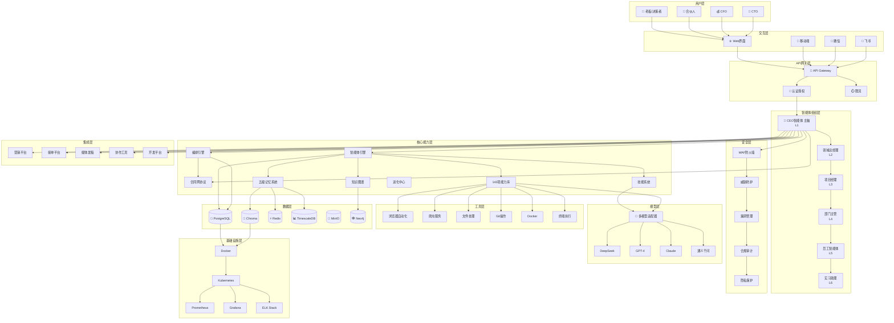
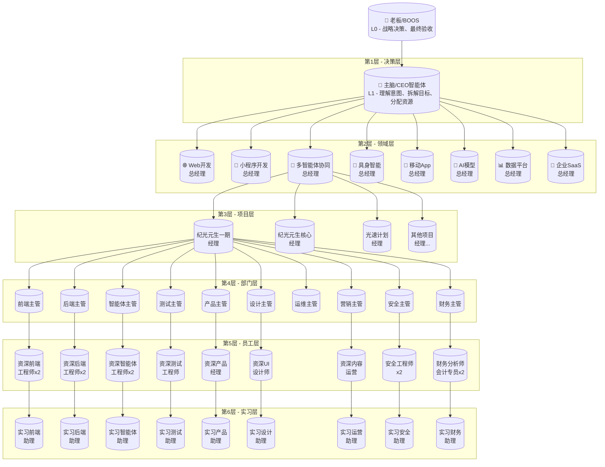
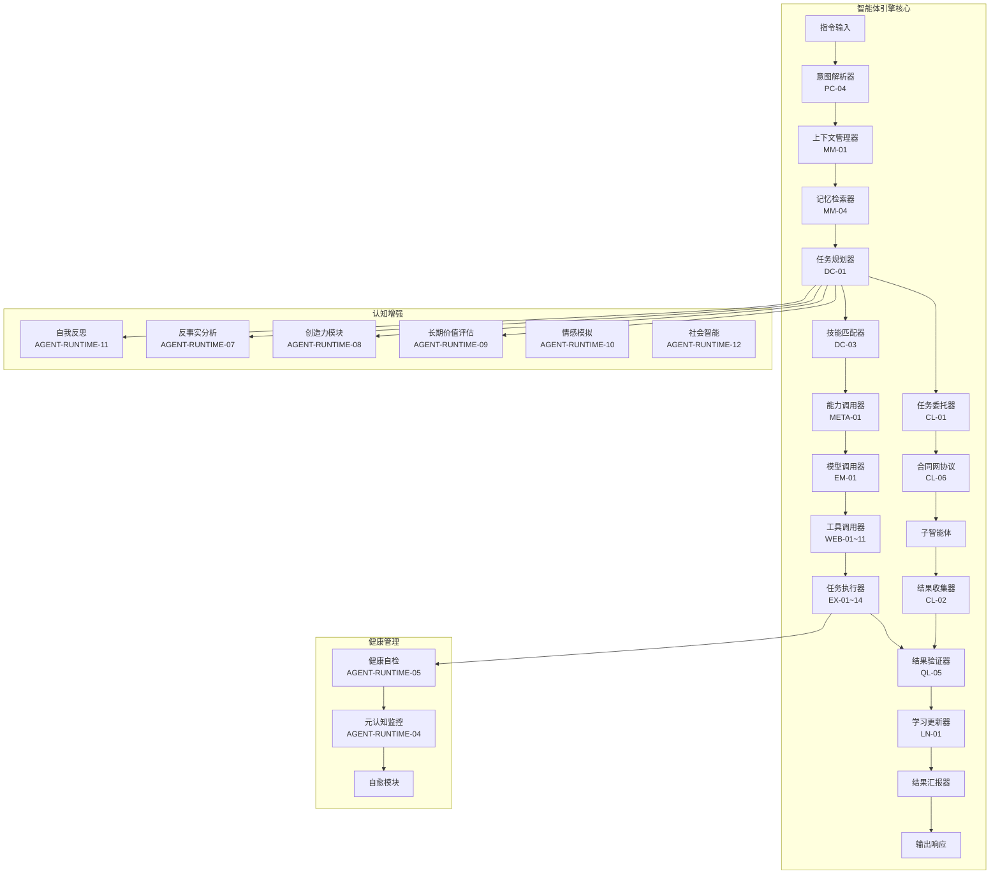
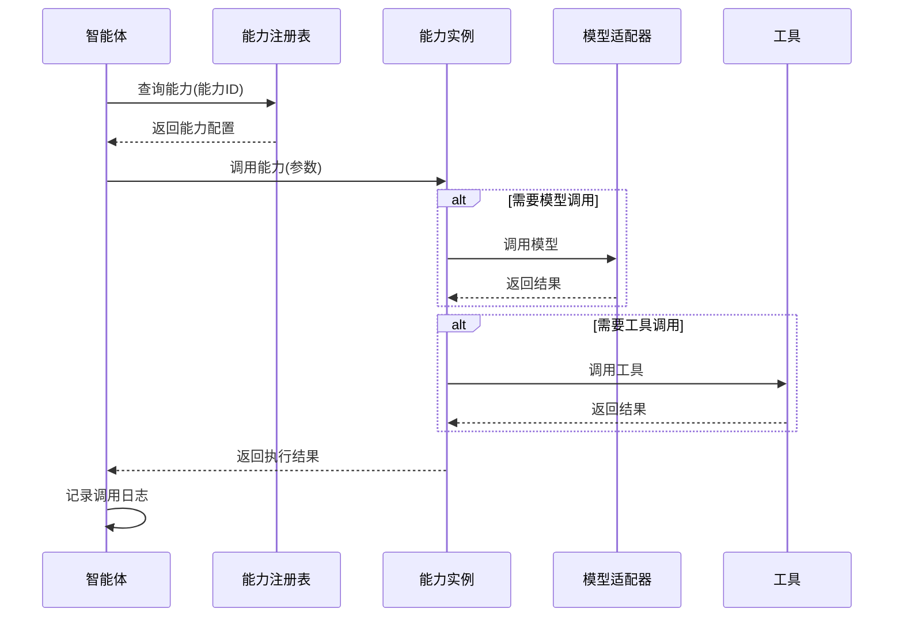
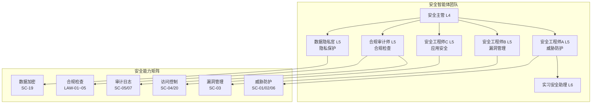
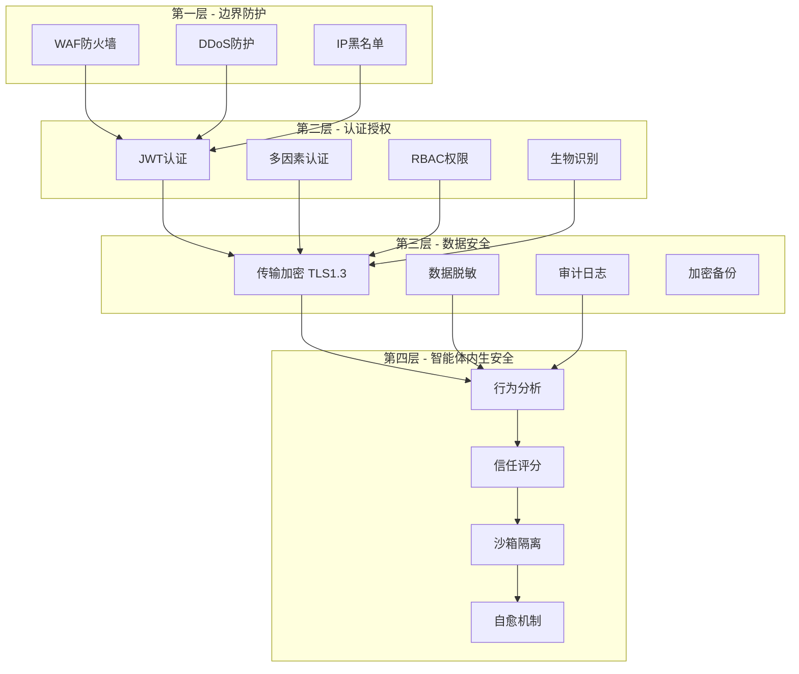
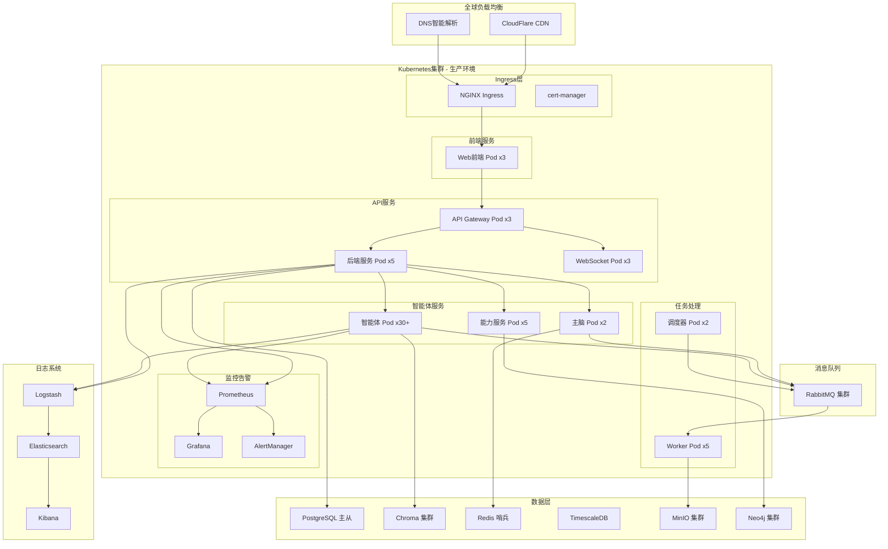
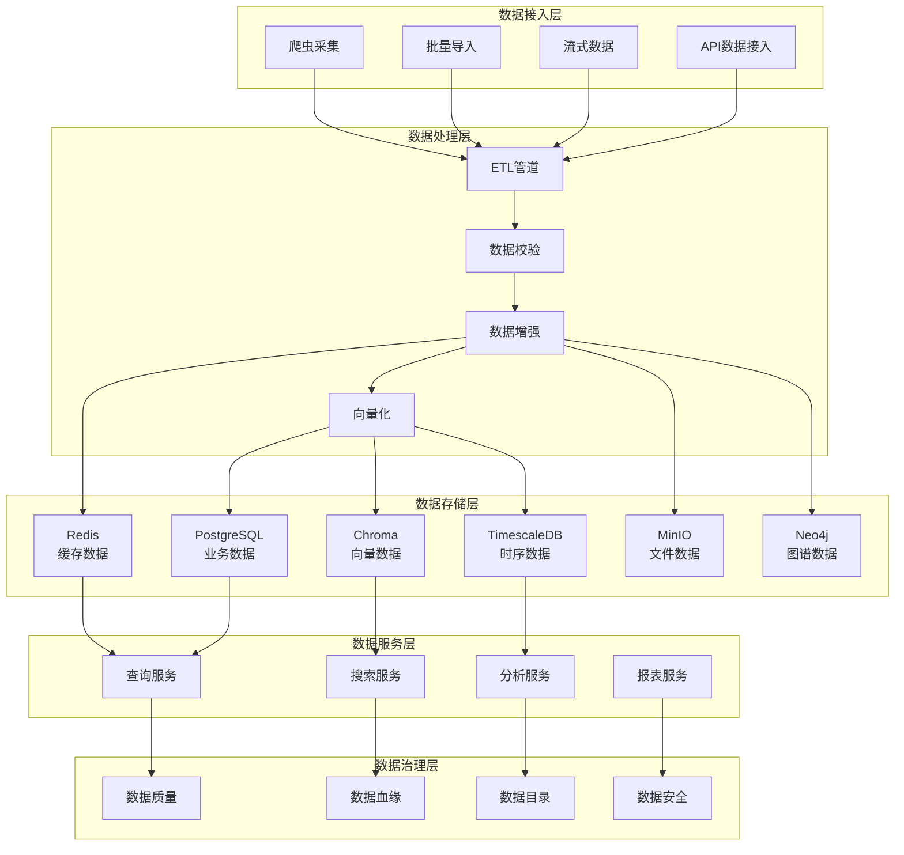

# 纪光元生智能系统 - 架构设计文档

| 文档版本 | 修改日期 | 修改人 | 修改内容 |
|---------|---------|--------|---------|
| v1.0 | 2026-01-13 | AI助手 | 完整版：基于所有子文件和对话内容，补充智能体引擎详细架构、能力架构、安全架构、部署架构、142项能力映射 |


## 一、架构概述

### 1.1 架构设计原则

| 原则 | 说明 | 关联能力 |
|------|------|----------|
| **人机协同优先** | 老板是决策者，智能体是执行者，通过CEO智能体（主脑）交互 | AGENT-RUNTIME-01 |
| **组织化分级** | 智能体按七层企业架构分级，有明确的职级、权限、汇报关系 | HR-01~05 |
| **领域专精** | 不同开发领域有不同的组织架构模板和技能配置 | DOMAIN_SWITCH |
| **记忆驱动** | 每个智能体具备五级记忆能力，支持跨会话经验保留 | MM-01~08 |
| **能力可插拔** | 智能体的能力通过142项能力库定义，支持动态加载 | META-01/05 |
| **模型无关** | 统一的大模型适配层，支持对接任意模型，支持降级 | EM-01~11 |
| **自举能力** | 系统能够使用自身开发自身 | META-03 |
| **安全内生** | 安全能力内置，智能体团队自主防护 | SC-01~20 |
| **持续进化** | 智能体具备学习能力，越用越聪明 | LN-01~06 |

### 1.2 系统架构全景图




## 二、智能体组织架构

### 2.1 七层组织架构图（完整版）



### 2.2 21个部门完整清单

| 部门ID | 部门名称 | 类别 | 主管 | 员工数 | 关联能力 |
|--------|---------|------|------|--------|----------|
| DEP-01 | 产品部 | 核心研发 | 产品主管 | 2 | PD-01~06 |
| DEP-02 | 设计部 | 核心研发 | 设计主管 | 2 | DS-01~05 |
| DEP-03 | 前端部 | 核心研发 | 前端主管 | 3 | FE-01~06 |
| DEP-04 | 后端部 | 核心研发 | 后端主管 | 3 | BE-01~06 |
| DEP-05 | 智能体部 | 核心研发 | 智能体主管 | 3 | AG-01~06 |
| DEP-06 | 测试部 | 核心研发 | 测试主管 | 2 | QA-01~06 |
| DEP-07 | 运维部 | 核心研发 | 运维主管 | 2 | OPS-01~06 |
| DEP-08 | 人事行政部 | 支撑服务 | 人事行政主管 | 4 | HR-01~05 |
| DEP-09 | 财务部 | 支撑服务 | 财务主管 | 4 | FIN-01~05 |
| DEP-10 | 法务合规部 | 支撑服务 | 法务合规主管 | 3 | LAW-01~05 |
| DEP-11 | 战略发展部 | 支撑服务 | 战略发展主管 | 3 | STRAT-01~04 |
| DEP-12 | 营销部 | 业务拓展 | 营销主管 | 4 | MK-01~30 |
| DEP-13 | 销售部 | 业务拓展 | 销售主管 | 4 | SALES-01~05 |
| DEP-14 | 客户成功部 | 业务拓展 | 客户成功主管 | 4 | CS-01~05 |
| DEP-15 | 生态合作部 | 业务拓展 | 生态合作主管 | 3 | ECO-01~04 |
| DEP-16 | 内部审计部 | 治理监管 | 审计主管 | 2 | AUDIT-01~04 |
| DEP-17 | 风险管理部 | 治理监管 | 风控主管 | 2 | RISK-01~04 |
| DEP-18 | 质量管理部 | 治理监管 | 质量主管 | 2 | QM-01~04 |
| DEP-19 | 信息技术部 | 支撑服务 | IT主管 | 3 | IT-01~03 |
| DEP-20 | 渠道管理部 | 业务拓展 | 渠道主管 | 3 | CH-01~03 |
| DEP-21 | 安全合规部 | 治理监管 | 安全合规主管 | 3 | SEC-01~05 |

### 2.3 职级与权限矩阵

| 层级 | 职级 | 权限范围 | 可审批 | 能力范围 | 信任分要求 |
|------|------|---------|--------|---------|-----------|
| L0 | 老板 | 全部 | 全部 | - | - |
| L1 | CEO | 战略级 | 立项、预算、资源 | 全部142项 | 100 |
| L2 | 总经理 | 领域级 | 项目计划书 | 100+项 | 90+ |
| L3 | 经理 | 项目级 | 技术方案 | 80+项 | 85+ |
| L4 | 主管 | 部门级 | 代码审查、任务分配 | 60+项 | 80+ |
| L5 | 员工 | 执行级 | 无 | 40+项 | 75+ |
| L6 | 实习 | 辅助级 | 无 | 20+项 | 60+ |


## 三、智能体引擎详细架构

### 3.1 智能体引擎内部架构



### 3.2 智能体主循环（AGENT-RUNTIME-01）

```python
class BaseAgent:
    """智能体基类 - 实现主循环"""
    
    async def run(self):
        """智能体主循环"""
        while self.active:
            # 1. 感知 - 从环境、消息、记忆中获取信息
            perceptions = await self.perceive()
            
            # 2. 推理 - 结合目标、记忆、心智模型推理当前状态
            state = await self.reason(perceptions)
            
            # 3. 规划 - 生成多步行动计划
            plans = await self.plan(state)
            
            # 4. 行动 - 执行最高优先级的行动
            for action in plans:
                result = await self.act(action)
                await self.update_mental_models(action, result)
            
            # 5. 学习 - 从结果中学习，更新知识
            await self.learn()
            
            # 6. 反思 - 定期自我反思
            await self.reflect()
            
            # 7. 健康检查 - 自检与自愈
            await self.health_check()
            
            await asyncio.sleep(0.1)
```


## 四、142项能力架构

### 4.1 能力分类架构

```mermaid
graph TB
    subgraph "能力体系 - 142项"
        
        subgraph "智能体运行时 12项"
            RT[AGENT-RUNTIME-01~12<br/>主循环、偏好、解释、监控、自愈、心智、反事实、创造、价值、情感、反思、社会]
        end
        
        subgraph "互联网工具 11项"
            WEB[WEB-01~11<br/>浏览器、搜索、解析、API、社交、文档、存储、通讯、代码托管、学习、云服务]
        end
        
        subgraph "知识获取 6项"
            KNOW[KNOW-01~06<br/>爬取、评估、图谱、优化、迁移、监控]
        end
        
        subgraph "法律合规 5项"
            LAW[LAW-01~05<br/>内容审核、隐私、版权、访问检查、报告]
        end
        
        subgraph "自动化 6项"
            AUTO[AUTO-01~06<br/>规划、恢复、编排、速率、定时、测试]
        end
        
        subgraph "感知能力 10项"
            PC[PC-01~10<br/>NLP、代码、日志、意图、实体、摘要、文档、数据、情感、终端]
        end
        
        subgraph "认知能力 12项"
            CG[CG-01~12<br/>推理、类比、常识、数值、心智、因果、抽象、批判、不确定、时序、空间、反事实]
        end
        
        subgraph "决策能力 15项"
            DC[DC-01~15<br/>规划、分解、工具、资源、优先级、方案、对比、风险、自主、时机、成本、解释、试探、MCTS、贝叶斯]
        end
        
        subgraph "执行能力 14项"
            EX[EX-01~14<br/>代码生成、修改、API、数据库、文件、命令、测试、消息、并行、异步、定时、批量、幂等、限流]
        end
        
        subgraph "记忆能力 8项"
            MM[MM-01~08<br/>工作、短期、长期、检索、共享、巩固、遗忘、联想]
        end
        
        subgraph "学习能力 6项"
            LN[LN-01~06<br/>反馈、示例、指令、双循环、内在动机、经验回放]
        end
        
        subgraph "元能力 5项"
            META[META-01~05<br/>扩展、策略、进化、自省、注册]
        end
    end
```



### 4.2 能力调用流程




## 五、安全架构

### 5.1 安全智能体团队架构



### 5.2 安全防护层次




## 六、部署架构

### 6.1 完整部署架构




## 七、数据架构

### 7.1 数据分层架构




## 八、集成架构

### 8.1 外部平台集成架构

```mermaid
graph TB
    subgraph "JYIS核心"
        INTEGRATION[集成管理中心]
        ADAPTER[适配器工厂]
    end

    subgraph "AI模型集成"
        DEEPSEEK[DeepSeek]
        OPENAI[OpenAI GPT-4]
        ANTHROPIC[Anthropic Claude]
        QWEN[通义千问]
        WENXIN[文心一言]
    end

    subgraph "内容平台集成"
        WECHAT_MP[微信公众号]
        ZHIHU[知乎]
        JUEJIN[掘金]
        BILI[B站]
        DOUYIN[抖音]
        REDBOOK[小红书]
        TWITTER[Twitter/X]
        LINKEDIN[LinkedIn]
    end

    subgraph "接单平台集成"
        PROGINN[程序员客栈]
        MASHANGDA[码上达]
        UPWORK[Upwork]
        CODING[码市]
    end

    subgraph "媒体发稿集成"
        CHUANSHENG[传声港]
        PEOPLE[人民网]
        XINHUA[新华网]
    end

    subgraph "协作工具集成"
        FEISHU[飞书]
        WECOM[企业微信]
        DINGTALK[钉钉]
        TELEGRAM[Telegram]
    end

    subgraph "开发平台集成"
        GITHUB[GitHub]
        GITLAB[GitLab]
        DOCKER_HUB[Docker Hub]
        ALIYUN[阿里云]
        AWS[AWS]
    end

    INTEGRATION --> ADAPTER
    ADAPTER --> DEEPSEEK
    ADAPTER --> OPENAI
    ADAPTER --> ANTHROPIC
    ADAPTER --> QWEN
    ADAPTER --> WENXIN
    
    ADAPTER --> WECHAT_MP
    ADAPTER --> ZHIHU
    ADAPTER --> JUEJIN
    ADAPTER --> BILI
    ADAPTER --> DOUYIN
    
    ADAPTER --> PROGINN
    ADAPTER --> MASHANGDA
    ADAPTER --> UPWORK
    
    ADAPTER --> CHUANSHENG
    
    ADAPTER --> FEISHU
    ADAPTER --> WECOM
    
    ADAPTER --> GITHUB
    ADAPTER --> GITLAB
    ADAPTER --> ALIYUN
```




## 九、架构决策记录（ADR）

### ADR-001：选择FastAPI作为后端框架
- **状态**：已采纳
- **理由**：原生异步支持、自动生成API文档、类型提示完善、与AI生态集成良好

### ADR-002：采用七层智能体组织架构
- **状态**：已采纳
- **理由**：符合企业真实组织架构、权限边界清晰、支持向上汇报和向下委派

### ADR-003：使用Chroma作为向量数据库
- **状态**：已采纳
- **理由**：轻量级、与LangChain集成良好、开源免费

### ADR-004：支持多模型适配器模式
- **状态**：已采纳
- **理由**：解耦模型依赖、支持降级和负载均衡、便于A/B测试

### ADR-005：实现合同网协议（CL-06）
- **状态**：已采纳
- **理由**：支持智能体间动态任务分配、基于信任评分和能力匹配、支持负载均衡

### ADR-006：五级记忆架构
- **状态**：已采纳
- **理由**：工作记忆(实时)、短期记忆(7天)、长期记忆(永久)、共享记忆(部门级)、全局记忆(系统级)

### ADR-007：142项能力体系
- **状态**：已采纳
- **理由**：覆盖智能体运行所需的全部能力、支持动态加载和热更新、能力可组合

### ADR-008：安全智能体团队
- **状态**：已采纳
- **理由**：安全能力内生、智能体自主防护、主脑管理安全团队


## 十、版本记录

| 版本 | 日期 | 修改内容 |
|------|------|---------|
| v1.0 | 2026-01-13 | 完整版：基于所有子文件和对话内容，补充智能体引擎详细架构、142项能力架构、安全架构、部署架构、数据架构、集成架构、ADR |