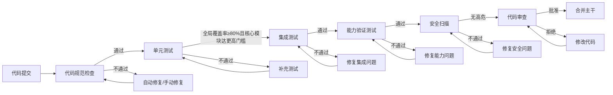
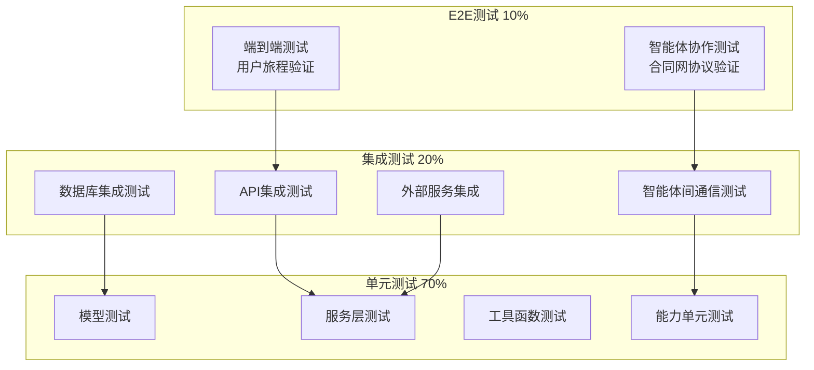
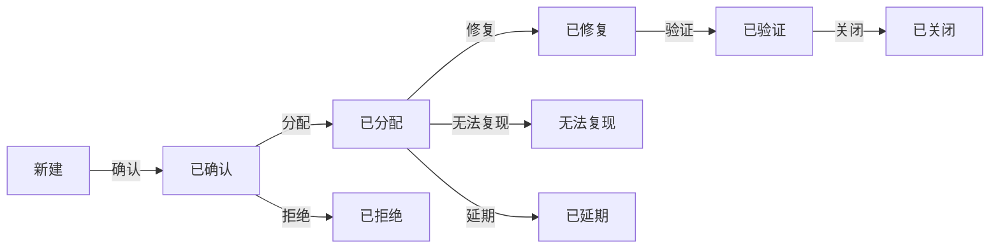
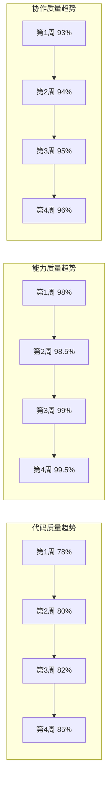

# 纪光元生智能系统 - 质量标准清单

| 文档版本 | 修改日期 | 修改人 | 修改内容 |
|---------|---------|--------|---------|
| v1.0 | 2026-01-12 | AI助手 | 完整版：基于所有子文件和对话内容，补充智能体质量标准、能力质量标准、安全质量标准、团队质量标准 |


## 一、质量标准总览

### 1.1 质量目标

| 质量维度 | 目标值 | 测量方式 | 关联能力 | 负责团队 |
|---------|--------|---------|----------|---------|
| 代码覆盖率 | ≥ 80% | pytest-cov | QL-05 质量验证 | 测试部 |
| 圈复杂度 | ≤ 10 | radon / ruff | QL-01 代码质量感知 | 后端部 |
| 代码重复率 | ≤ 3% | radon | QL-01 代码质量感知 | 后端部 |
| API成功率 | ≥ 99.5% | 监控系统 | PO-01 响应时间优化 | 运维部 |
| API响应时间(P95) | ≤ 180秒（单次≤300秒） | 监控系统 | PO-01 响应时间优化 | 运维部 |
| 系统可用性 | ≥ 99.5% | 监控系统 | AGENT-RUNTIME-05 健康自检 | 运维部 |
| 缺陷密度 | ≤ 2/KLOC | 缺陷追踪 | QL-07 质量趋势分析 | 测试部 |
| 文档完整度 | ≥ 90% | 人工检查 | - | 营销部 |
| 能力激活率 | 100% | 能力库统计 | META-05 能力注册 | 智能体部 |
| 能力响应成功率 | ≥ 99% | 监控系统 | QL-05 质量验证 | 智能体部 |
| 智能体协作成功率 | ≥ 95% | 监控系统 | CL-06 合同网协议 | 项目部 |
| 安全扫描通过率 | 100% (无高危) | 安全扫描 | SC-01~20 安全能力 | 安全部 |
| 学习效果提升率 | ≥ 10%/月 | 绩效评估 | LN-01~06 学习能力 | 智能体部 |

### 1.2 质量门禁



### 1.3 智能体团队质量职责

| 团队 | 质量职责 | 关联质量标准 |
|------|---------|-------------|
| 测试部 | 测试执行、Bug追踪、质量报告 | QL-05 质量验证 |
| 后端部 | 代码质量、API性能、数据库优化 | QL-01 代码质量感知 |
| 前端部 | UI质量、响应式、性能优化 | COMPAT-01/02 兼容性 |
| 智能体部 | 能力质量、智能体性能、进化效果 | META-05 能力注册 |
| 安全部 | 安全扫描、漏洞修复、合规检查 | SC-01~20 安全能力 |
| 运维部 | 系统稳定性、监控告警、容灾 | AGENT-RUNTIME-05 健康自检 |
| 营销部 | 文档质量、用户体验、内容质量 | MK-07 内容审核 |


## 二、代码规范

### 2.1 Python代码规范（PEP 8 + 增强）

| 规范项 | 要求 | 检查工具 | 关联能力 |
|--------|------|---------|----------|
| 缩进 | 4个空格 | ruff / black | - |
| 行长度 | ≤ 88字符 | black / ruff | - |
| 命名规范 | 类名: PascalCase, 函数/变量: snake_case | ruff | - |
| 导入顺序 | 标准库 → 第三方 → 本地模块 | isort | - |
| 类型注解 | 所有函数参数和返回值必须有类型注解 | mypy | QL-04 质量自检 |
| 文档字符串 | 公共函数必须有docstring | pydocstyle | - |
| 异步规范 | 使用async/await，避免阻塞 | ruff | EX-10 异步执行 |
| 错误处理 | 明确的异常类型，避免裸except | ruff | AGENT-RUNTIME-05 健康自检 |

**示例代码**：

```python
# ✅ 正确示例
from typing import List, Optional
from datetime import datetime

from sqlalchemy import String, Integer
from sqlalchemy.orm import Mapped, mapped_column

from backend.core.database import Base
from backend.core.exceptions import AgentNotFoundError, InvalidLevelError


class Agent(Base):
    """智能体数据模型。
    
    对应能力：AGENT-RUNTIME-01 智能体主循环
    
    Attributes:
        id: 智能体唯一标识
        name: 智能体名称
        level: 层级(1-6)
        status: 状态(online/offline/busy/error/degraded)
        trust_score: 信任评分(0-100)
    """
    
    __tablename__ = "agents"
    
    id: Mapped[str] = mapped_column(String(36), primary_key=True)
    name: Mapped[str] = mapped_column(String(100), nullable=False)
    level: Mapped[int] = mapped_column(Integer, nullable=False)
    status: Mapped[str] = mapped_column(String(20), default="offline")
    trust_score: Mapped[float] = mapped_column(default=50.0)
    
    async def promote(self, new_level: int) -> bool:
        """提升智能体层级。
        
        对应能力：HR-04 智能体升职与调岗
        
        Args:
            new_level: 新层级(必须大于当前层级)
            
        Returns:
            是否提升成功
            
        Raises:
            InvalidLevelError: 当新层级无效时
        """
        if new_level <= self.level:
            raise InvalidLevelError(
                f"新层级 {new_level} 必须大于当前层级 {self.level}"
            )
        if new_level > 6:
            raise InvalidLevelError(f"层级不能超过6，当前值: {new_level}")
            
        self.level = new_level
        self.trust_score = min(100, self.trust_score + 5)
        return True
    
    async def update_trust_score(self, task_result: dict) -> None:
        """根据任务结果更新信任评分。
        
        对应能力：AGENT-RUNTIME-06 心智模型维护
        
        Args:
            task_result: 任务执行结果，包含success、quality、timeliness
        """
        success_weight = 0.4
        quality_weight = 0.3
        timeliness_weight = 0.3
        
        score = (
            (1 if task_result["success"] else 0) * success_weight +
            task_result.get("quality", 0.5) * quality_weight +
            task_result.get("timeliness", 0.5) * timeliness_weight
        ) * 100
        
        # 平滑更新
        self.trust_score = self.trust_score * 0.9 + score * 0.1


# ❌ 错误示例
class agent:  # 类名应为PascalCase
    def __init__(self, name, level):  # 缺少类型注解，缺少docstring
        self.name = name
        self.level=level  # 缺少空格
    
    def promote(self,new_level):  # 缺少空格，缺少返回类型
        # 没有错误处理
        if new_level>self.level:  # 缺少空格
            self.level=new_level
            return True
        return False
```

### 2.2 类型注解规范（mypy + 严格模式）

**mypy配置文件** (`mypy.ini`)：

```ini
[mypy]
python_version = 3.11
strict = True
warn_return_any = True
warn_unused_configs = True
disallow_untyped_defs = True
disallow_incomplete_defs = True
check_untyped_defs = True
no_implicit_optional = True
warn_redundant_casts = True
warn_unused_ignores = True
plugins = sqlalchemy.ext.mypy.plugin

# 智能体相关模块的额外检查
[mypy-backend.services.agent_service.*]
disallow_untyped_defs = True
warn_unreachable = True

[mypy-backend.core.agent_engine.*]
disallow_any_generics = True
```

### 2.3 代码格式化规范（black + isort）

**pyproject.toml配置**：

```toml
[tool.black]
line-length = 88
target-version = ['py311']
include = '\.pyi?$'

[tool.isort]
profile = "black"
line_length = 88
multi_line_output = 3
include_trailing_comma = true
force_grid_wrap = 0
use_parentheses = true
ensure_newline_before_comments = true

# 智能体模块导入分组
known_first_party = ["backend"]
known_third_party = ["fastapi", "sqlalchemy", "langchain", "openai"]
sections = ["FUTURE", "STDLIB", "THIRDPARTY", "FIRSTPARTY", "LOCALFOLDER"]
```

### 2.4 代码质量检查（ruff + 增强规则）

**ruff配置文件** (`ruff.toml`)：

```toml
line-length = 88
target-version = "py311"

[lint]
select = [
    "E",   # pycodestyle errors
    "W",   # pycodestyle warnings
    "F",   # pyflakes
    "I",   # isort
    "C",   # mccabe
    "UP",  # pyupgrade
    "B",   # flake8-bugbear
    "SIM", # flake8-simplify
    "RET", # flake8-return
    "ASYNC", # flake8-async
    "TID", # flake8-tidy-imports
    "RUF", # ruff specific
]
ignore = ["E501"]  # 行长度由black处理

[lint.mccabe]
max-complexity = 10

[lint.per-file-ignores]
"__init__.py" = ["F401"]  # 允许未使用的导入
"tests/*" = ["S101"]  # 测试中允许使用assert

[lint.isort]
known-first-party = ["backend"]
```

### 2.5 前端代码规范（Vue 3 + TypeScript + ESLint）

| 规范项 | 要求 | 检查工具 | 关联能力 |
|--------|------|---------|----------|
| 组件命名 | PascalCase | ESLint | - |
| 文件命名 | PascalCase.vue | ESLint | - |
| 组合式API | 优先使用 `<script setup>` | ESLint | - |
| 类型定义 | 所有props/emits必须有类型 | TypeScript | QL-04 质量自检 |
| CSS作用域 | 使用 `scoped` 或 CSS Modules | stylelint | - |
| 响应式规范 | 使用ref/reactive | ESLint | FE-RESP-03 媒体查询 |
| 性能规范 | 避免不必要的重渲染 | ESLint | FE-PERF-07 渲染优化 |

**ESLint配置** (`.eslintrc.cjs`)：

```javascript
module.exports = {
  extends: [
    'plugin:vue/vue3-recommended',
    '@vue/typescript/recommended',
    'plugin:prettier/recommended'
  ],
  rules: {
    'vue/component-name-in-template-casing': ['error', 'PascalCase'],
    'vue/require-default-prop': 'error',
    'vue/require-explicit-emits': 'error',
    '@typescript-eslint/no-explicit-any': 'error',
    '@typescript-eslint/explicit-function-return-type': 'error',
    'no-console': process.env.NODE_ENV === 'production' ? 'error' : 'warn',
    'no-debugger': process.env.NODE_ENV === 'production' ? 'error' : 'warn'
  }
}
```

**示例代码**：

```vue
<!-- ✅ 正确示例 -->
<script setup lang="ts">
import { ref, computed, onMounted } from 'vue'
import { useAgentStore } from '@/stores/agent'

/**
 * 智能体卡片组件
 * 对应能力：AGENT-RUNTIME-06 心智模型维护
 */
interface Props {
  /** 智能体ID */
  agentId: string
  /** 是否显示详细信息 */
  showDetail?: boolean
  /** 是否可编辑 */
  editable?: boolean
}

const props = withDefaults(defineProps<Props>(), {
  showDetail: false,
  editable: false
})

const emit = defineEmits<{
  (e: 'update', agentId: string): void
  (e: 'delete', agentId: string): void
  (e: 'error', error: Error): void
}>()

const agentStore = useAgentStore()
const isLoading = ref(false)
const agent = computed(() => agentStore.getAgentById(props.agentId))

const handleUpdate = async () => {
  isLoading.value = true
  try {
    await agentStore.updateAgent(props.agentId)
    emit('update', props.agentId)
  } catch (error) {
    emit('error', error as Error)
  } finally {
    isLoading.value = false
  }
}

onMounted(() => {
  if (!agent.value) {
    agentStore.fetchAgent(props.agentId)
  }
})
</script>

<template>
  <div class="agent-card" :class="{ 'agent-card--loading': isLoading }">
    <div v-if="agent" class="agent-card__content">
      <h3 class="agent-card__name">{{ agent.name }}</h3>
      <p class="agent-card__level">层级: L{{ agent.level }}</p>
      <div class="agent-card__trust">
        <span>信任分: {{ agent.trustScore }}</span>
        <progress :value="agent.trustScore" max="100" />
      </div>
      <div v-if="showDetail" class="agent-card__detail">
        <p>状态: {{ agent.status }}</p>
        <p>认知负载: {{ (agent.cognitiveLoad * 100).toFixed(0) }}%</p>
      </div>
      <div class="agent-card__actions">
        <button @click="handleUpdate" :disabled="isLoading || !editable">
          {{ isLoading ? '更新中...' : '更新' }}
        </button>
      </div>
    </div>
    <div v-else class="agent-card__empty">
      智能体不存在
    </div>
  </div>
</template>

<style scoped>
.agent-card {
  border: 1px solid var(--jyis-border-color);
  border-radius: 8px;
  padding: 16px;
  transition: all 0.3s ease;
}

.agent-card--loading {
  opacity: 0.6;
  pointer-events: none;
}

.agent-card__name {
  margin: 0 0 8px;
  font-size: 18px;
  font-weight: 600;
}

.agent-card__trust progress {
  width: 100%;
  height: 8px;
  border-radius: 4px;
}

.agent-card__actions {
  margin-top: 16px;
  display: flex;
  gap: 8px;
}
</style>
```


## 三、测试要求

### 3.1 测试金字塔（智能体增强版）



### 3.2 单元测试要求

| 测试类型 | 覆盖率要求 | 测试框架 | 负责团队 | 关联能力 |
|---------|-----------|---------|---------|----------|
| 数据模型 | 100% | pytest + pytest-sqlalchemy | 后端部 | EX-07 测试执行 |
| 服务层 | ≥ 85% | pytest + pytest-asyncio | 后端部 | EX-07 测试执行 |
| 工具函数 | 100% | pytest | 后端部 | EX-07 测试执行 |
| API路由 | ≥ 80% | pytest + httpx | 测试部 | EX-07 测试执行 |
| 能力单元 | ≥ 90% | pytest | 智能体部 | META-05 能力注册 |
| 前端组件 | ≥ 70% | Vitest | 前端部 | FE-TEST-01~04 |
| 前端stores | ≥ 85% | Vitest | 前端部 | FE-TEST-01 |
| 前端utils | ≥ 90% | Vitest | 前端部 | FE-TEST-01 |

**单元测试示例**：

```python
# tests/unit/test_agent_service.py
import pytest
from unittest.mock import AsyncMock, Mock

from backend.services.agent_service import AgentService
from backend.models.agent import Agent
from backend.core.exceptions import AgentNotFoundError, InvalidLevelError


@pytest.mark.asyncio
class TestAgentService:
    """智能体服务单元测试
    对应能力：HR-01 智能体创建与配置
    """
    
    async def test_create_agent_success(self, db_session):
        """测试：成功创建智能体"""
        # Arrange
        service = AgentService(db_session)
        agent_data = {
            "name": "测试智能体",
            "level": 3,
            "type": "pm",
            "department": "项目部",
            "parent_id": None
        }
        
        # Act
        result = await service.create_agent(agent_data)
        
        # Assert
        assert result.id is not None
        assert result.name == "测试智能体"
        assert result.level == 3
        assert result.status == "offline"
        assert result.trust_score == 50.0
    
    async def test_create_agent_invalid_level(self, db_session):
        """测试：创建智能体时层级无效"""
        service = AgentService(db_session)
        agent_data = {
            "name": "测试智能体",
            "level": 10,  # 无效层级
            "type": "pm"
        }
        
        with pytest.raises(InvalidLevelError, match="无效的层级"):
            await service.create_agent(agent_data)
    
    async def test_create_agent_invalid_parent(self, db_session):
        """测试：创建智能体时父级层级不合法"""
        service = AgentService(db_session)
        
        # 创建父级智能体(L3)
        parent = await service.create_agent({
            "name": "父级智能体",
            "level": 3,
            "type": "pm"
        })
        
        # 尝试创建L2智能体作为L3的子级（应该失败）
        with pytest.raises(InvalidLevelError, match="下级层级必须大于上级层级"):
            await service.create_agent({
                "name": "子级智能体",
                "level": 2,
                "type": "gm",
                "parent_id": parent.id
            })
    
    async def test_get_agents_with_pagination(self, db_session):
        """测试：分页查询智能体列表"""
        service = AgentService(db_session)
        
        # 创建测试数据
        for i in range(25):
            await service.create_agent({
                "name": f"智能体{i}",
                "level": 1,
                "type": "ceo"
            })
        
        # 测试第一页
        result = await service.get_agents(page=1, page_size=10)
        assert len(result["items"]) == 10
        assert result["total"] == 25
        assert result["page"] == 1
        
        # 测试第二页
        result = await service.get_agents(page=2, page_size=10)
        assert len(result["items"]) == 10
        assert result["page"] == 2
    
    async def test_get_agents_with_filters(self, db_session):
        """测试：带筛选条件查询智能体"""
        service = AgentService(db_session)
        
        # 创建不同层级的智能体
        await service.create_agent({"name": "CEO1", "level": 1, "type": "ceo"})
        await service.create_agent({"name": "CEO2", "level": 1, "type": "ceo"})
        await service.create_agent({"name": "GM1", "level": 2, "type": "gm"})
        
        # 按层级筛选
        result = await service.get_agents(level=1)
        assert result["total"] == 2
        assert all(a["level"] == 1 for a in result["items"])
    
    async def test_update_agent_trust_score(self, db_session):
        """测试：更新智能体信任评分
        对应能力：AGENT-RUNTIME-06 心智模型维护
        """
        service = AgentService(db_session)
        
        agent = await service.create_agent({
            "name": "测试智能体",
            "level": 5,
            "type": "employee"
        })
        initial_score = agent.trust_score
        
        # 模拟任务成功
        await service.update_trust_score(agent.id, {
            "success": True,
            "quality": 0.9,
            "timeliness": 0.8
        })
        
        updated_agent = await service.get_agent(agent.id)
        assert updated_agent.trust_score > initial_score
```

### 3.3 能力测试要求

| 测试类型 | 覆盖率要求 | 测试框架 | 负责团队 | 关联能力 |
|---------|-----------|---------|---------|----------|
| 能力激活测试 | 100% | pytest | 智能体部 | META-05 能力注册 |
| 能力调用测试 | ≥ 90% | pytest | 智能体部 | QL-05 质量验证 |
| 能力降级测试 | 100% | pytest | 智能体部 | EM-03 模型降级 |
| 能力并发测试 | ≥ 80% | pytest + asyncio | 智能体部 | EX-09 并行执行 |

**能力测试示例**：

```python
# tests/capabilities/test_web_capabilities.py
import pytest
from unittest.mock import AsyncMock, patch

from backend.adapters.capabilities.web import WebCapability


@pytest.mark.asyncio
class TestWebCapabilities:
    """WEB能力测试
    对应能力：WEB-01 浏览器自动化, WEB-02 搜索引擎查询, WEB-03 网页内容解析
    """
    
    async def test_web_browser_automation(self):
        """测试：浏览器自动化能力 (WEB-01)"""
        capability = WebCapability()
        
        with patch('playwright.async_api.async_playwright') as mock_pw:
            mock_page = AsyncMock()
            mock_page.content.return_value = "<html><body>Test</body></html>"
            mock_pw.return_value.chromium.launch.return_value.new_page.return_value = mock_page
            
            result = await capability.browse("https://example.com")
            
            assert result["success"] is True
            assert result["content"] == "<html><body>Test</body></html>"
            assert "latency_ms" in result
    
    async def test_web_search_engine(self):
        """测试：搜索引擎查询能力 (WEB-02)"""
        capability = WebCapability()
        
        with patch('httpx.AsyncClient.get') as mock_get:
            mock_get.return_value.status_code = 200
            mock_get.return_value.json.return_value = {
                "results": [{"title": "Test", "url": "https://example.com"}]
            }
            
            result = await capability.search("测试关键词", engine="google")
            
            assert result["success"] is True
            assert len(result["results"]) > 0
            assert result["engine"] == "google"
    
    async def test_web_content_extraction(self):
        """测试：网页内容解析能力 (WEB-03)"""
        capability = WebCapability()
        
        html = """
        <html>
            <head><title>测试标题</title></head>
            <body>
                <article>这是主要内容</article>
                <div class="ad">广告内容</div>
            </body>
        </html>
        """
        
        result = await capability.extract_content(html)
        
        assert result["title"] == "测试标题"
        assert "主要内容" in result["content"]
        assert "广告内容" not in result["content"]
    
    async def test_web_capability_fallback(self):
        """测试：WEB能力降级 (EM-03)"""
        capability = WebCapability()
        
        # 模拟主搜索引擎失败
        with patch('httpx.AsyncClient.get') as mock_get:
            mock_get.side_effect = [Exception("Primary failed"), AsyncMock()]
            
            result = await capability.search_with_fallback("测试")
            
            assert result["success"] is True
            assert result["used_fallback"] is True
```

### 3.4 集成测试要求

| 测试场景 | 覆盖要求 | 测试框架 | 负责团队 | 关联能力 |
|---------|---------|---------|---------|----------|
| API端到端 | 100% | pytest + httpx | 测试部 | EX-03 API调用 |
| 数据库事务 | 100% | pytest + sqlalchemy | 测试部 | EX-04 数据库操作 |
| 外部服务Mock | 关键路径 | pytest + mock | 测试部 | WEB-04 API调用 |
| 智能体协作 | 关键路径 | pytest + asyncio | 测试部 | CL-06 合同网协议 |
| 记忆系统 | 100% | pytest + chromadb | 测试部 | MM-01~08 记忆能力 |

**集成测试示例**：

```python
# tests/integration/test_agent_collaboration.py
import pytest
from httpx import AsyncClient


@pytest.mark.asyncio
class TestAgentCollaboration:
    """智能体协作集成测试
    对应能力：CL-06 合同网协议
    """
    
    async def test_contract_net_protocol(self, client: AsyncClient, auth_token: str):
        """测试：合同网协议完整流程"""
        # 1. 创建任务
        task_resp = await client.post(
            "/api/v1/tasks",
            headers={"Authorization": f"Bearer {auth_token}"},
            json={
                "name": "合同网测试任务",
                "description": "需要多个智能体投标",
                "project_id": "test-project-id"
            }
        )
        assert task_resp.status_code == 201
        task_id = task_resp.json()["data"]["id"]
        
        # 2. 发起招标
        tender_resp = await client.post(
            f"/api/v1/tasks/{task_id}/tender",
            headers={"Authorization": f"Bearer {auth_token}"}
        )
        assert tender_resp.status_code == 200
        
        # 3. 获取投标列表
        bids_resp = await client.get(
            f"/api/v1/tasks/{task_id}/bids",
            headers={"Authorization": f"Bearer {auth_token}"}
        )
        assert bids_resp.status_code == 200
        bids = bids_resp.json()["data"]["bids"]
        assert len(bids) > 0
        
        # 4. 选择中标者
        winning_bid = bids[0]
        award_resp = await client.post(
            f"/api/v1/tasks/{task_id}/award",
            headers={"Authorization": f"Bearer {auth_token}"},
            json={"bid_id": winning_bid["id"]}
        )
        assert award_resp.status_code == 200
        
        # 5. 验证任务已分配
        task_detail = await client.get(
            f"/api/v1/tasks/{task_id}",
            headers={"Authorization": f"Bearer {auth_token}"}
        )
        assert task_detail.json()["data"]["assignee_id"] == winning_bid["agent_id"]
        assert task_detail.json()["data"]["status"] == "assigned"
    
    async def test_agent_self_reflection(self, client: AsyncClient, auth_token: str):
        """测试：智能体自我反思
        对应能力：AGENT-RUNTIME-11 自我反思
        """
        # 1. 触发自我反思
        reflect_resp = await client.post(
            "/api/v1/agents/test-agent-id/reflect",
            headers={"Authorization": f"Bearer {auth_token}"}
        )
        assert reflect_resp.status_code == 200
        
        # 2. 获取反思报告
        report_resp = await client.get(
            "/api/v1/agents/test-agent-id/reflection",
            headers={"Authorization": f"Bearer {auth_token}"}
        )
        assert report_resp.status_code == 200
        data = report_resp.json()["data"]
        
        assert "insights" in data
        assert "improvement_plan" in data
        assert "overall_score" in data
    
    async def test_learning_feedback_loop(self, client: AsyncClient, auth_token: str):
        """测试：学习反馈循环
        对应能力：LN-01 反馈学习, LN-04 双循环学习
        """
        agent_id = "test-agent-id"
        
        # 1. 记录反馈
        for i in range(5):
            feedback_resp = await client.post(
                f"/api/v1/agents/{agent_id}/feedback",
                headers={"Authorization": f"Bearer {auth_token}"},
                json={
                    "task_id": f"task-{i}",
                    "rating": 4 if i < 3 else 5,
                    "comment": f"测试反馈{i}"
                }
            )
            assert feedback_resp.status_code == 200
        
        # 2. 获取学习状态
        learning_resp = await client.get(
            f"/api/v1/agents/{agent_id}/learning",
            headers={"Authorization": f"Bearer {auth_token}"}
        )
        assert learning_resp.status_code == 200
        data = learning_resp.json()["data"]
        
        assert data["feedback_count"] == 5
        assert data["positive_feedback"] >= 3
        assert "learning_rate" in data
```

### 3.5 E2E测试要求

| 测试场景 | 覆盖用户旅程 | 工具 | 负责团队 | 关联能力 |
|---------|-------------|------|---------|----------|
| 用户登录到创建智能体 | 完整流程 | Playwright | 测试部 | - |
| 创建项目到任务完成 | 完整流程 | Playwright | 测试部 | DC-01/02 |
| 智能体对话到任务委托 | 完整流程 | Playwright | 测试部 | CL-01/06 |
| 能力配置到能力调用 | 完整流程 | Playwright | 测试部 | META-01 |
| 安全事件响应 | 完整流程 | Playwright | 安全部 | SC-01~20 |

### 3.6 测试覆盖率要求

| 模块 | 最低覆盖率 | 目标覆盖率 | 负责团队 |
|------|-----------|-----------|---------|
| backend/models | 100% | 100% | 后端部 |
| backend/services | 85% | 90% | 后端部 |
| backend/api | 80% | 85% | 后端部 |
| backend/core/agent_engine | 85% | 90% | 智能体部 |
| backend/adapters/capabilities | 90% | 95% | 智能体部 |
| backend/core/memory | 85% | 90% | 智能体部 |
| backend/core/security | 90% | 95% | 安全部 |
| frontend/src/stores | 80% | 85% | 前端部 |
| frontend/src/utils | 90% | 95% | 前端部 |
| frontend/src/components | 70% | 80% | 前端部 |


## 四、验收条件

### 4.1 功能验收标准

#### 智能体管理模块

| 功能 | 验收条件 | 关联能力 | 负责团队 |
|------|---------|----------|---------|
| 创建智能体 | [ ] 表单验证正确（名称必填、层级1-6）<br>[ ] 提交成功后列表可见新智能体<br>[ ] 层级关系正确（parent_id验证）<br>[ ] 自动初始化默认能力 | HR-01 | 智能体部 |
| 智能体列表 | [ ] 分页正常（每页20条）<br>[ ] 筛选功能正常（按层级、部门、状态）<br>[ ] 搜索功能正常（按名称）<br>[ ] 树形结构展示层级关系 | AGENT-RUNTIME-06 | 智能体部 |
| 智能体配置 | [ ] 可修改名称、描述、模型配置<br>[ ] 可分配/移除技能<br>[ ] 可配置记忆系统参数<br>[ ] 可配置健康检查参数 | HR-01, MM-01~08 | 智能体部 |
| 智能体监控 | [ ] 实时状态显示正确<br>[ ] 调用次数统计准确<br>[ ] 成功率计算正确<br>[ ] 认知负载显示正确 | AGENT-RUNTIME-04 | 智能体部 |
| 智能体对话 | [ ] 消息发送和接收正常<br>[ ] 流式响应正常<br>[ ] 上下文记忆正常<br>[ ] 思考过程可展示 | PC-01, AGENT-RUNTIME-03 | 智能体部 |
| 智能体自愈 | [ ] 异常检测正常<br>[ ] 自动重启正常<br>[ ] 任务迁移正常 | AGENT-RUNTIME-05 | 智能体部 |

#### 项目管理模块

| 功能 | 验收条件 | 关联能力 | 负责团队 |
|------|---------|----------|---------|
| 创建项目 | [ ] 项目计划书结构验证正确<br>[ ] 提交后状态为"待审批"<br>[ ] 关联正确的领域总经理 | DC-01 | 项目部 |
| 项目审批 | [ ] 多级审批流转正确<br>[ ] 审批通过后状态变更<br>[ ] 审批拒绝时填写理由<br>[ ] 超时自动升级 | APPROVE-01~06 | 项目部 |
| 项目进度 | [ ] 进度百分比自动计算<br>[ ] 里程碑完成自动更新<br>[ ] 延期自动预警 | DC-01, CG-04 | 项目部 |
| 项目资源 | [ ] 资源池显示正确<br>[ ] 资源分配建议合理<br>[ ] 支持手动调整 | RS-01 | 项目部 |
| 项目风险 | [ ] 风险识别正常<br>[ ] 风险矩阵显示正确<br>[ ] 应对措施可追踪 | DC-08 | 项目部 |

#### 任务管理模块

| 功能 | 验收条件 | 关联能力 | 负责团队 |
|------|---------|----------|---------|
| 创建任务 | [ ] 任务正确分配给智能体<br>[ ] 依赖关系验证（无循环依赖）<br>[ ] 优先级正确设置 | DC-02 | 项目部 |
| 任务执行 | [ ] 状态流转正确<br>[ ] 执行结果正确记录<br>[ ] 失败自动重试（最多3次） | EX-10, EX-13 | 项目部 |
| 任务委托 | [ ] 只能委托给下级智能体<br>[ ] 委托后状态正确<br>[ ] 结果正确返回 | CL-01 | 项目部 |
| 合同网协议 | [ ] 招标流程正常<br>[ ] 投标评标正常<br>[ ] 中标执行正常 | CL-06 | 智能体部 |

#### 能力系统

| 功能 | 验收条件 | 关联能力 | 负责团队 |
|------|---------|----------|---------|
| 能力注册 | [ ] 142项能力全部注册<br>[ ] 能力分类正确<br>[ ] 能力等级配置正确 | META-05 | 智能体部 |
| 能力分配 | [ ] 能力可分配给智能体<br>[ ] 等级验证正确<br>[ ] 依赖检查正确 | META-01 | 智能体部 |
| 能力调用 | [ ] 调用成功率≥99%<br>[ ] 响应时间满足P95 ≤ 180秒，单次 ≤ 300秒<br>[ ] 降级策略生效 | EM-03, QL-05 | 智能体部 |
| 能力缺口 | [ ] 缺口检测正确<br>[ ] 建议合理<br>[ ] 支持一键通知主脑 | META-04 | 智能体部 |

#### 记忆系统

| 功能 | 验收条件 | 关联能力 | 负责团队 |
|------|---------|----------|---------|
| 记忆存储 | [ ] 文本正确向量化<br>[ ] 记忆类型正确分类<br>[ ] 过期记忆自动清理 | MM-01~03 | 智能体部 |
| 记忆检索 | [ ] 语义搜索返回相关结果<br>[ ] 相似度排序正确<br>[ ] 搜索结果包含相似度分数 | MM-04 | 智能体部 |
| 记忆巩固 | [ ] 短期记忆转长期记忆正常<br>[ ] 重要性评分正确<br>[ ] 定时巩固正常 | MM-06 | 智能体部 |
| 记忆共享 | [ ] 共享范围正确<br>[ ] 权限验证正确 | MM-05 | 智能体部 |

#### 安全系统

| 功能 | 验收条件 | 关联能力 | 负责团队 |
|------|---------|----------|---------|
| 认证安全 | [ ] 密码bcrypt加密<br>[ ] JWT有效期≤24小时<br>[ ] 支持token刷新<br>[ ] 生物识别可用 | SC-19, SC-20 | 安全部 |
| 授权安全 | [ ] 基于角色的访问控制<br>[ ] API权限验证<br>[ ] 数据级权限隔离 | SC-04 | 安全部 |
| 威胁防护 | [ ] WAF正常<br>[ ] DDoS防护正常<br>[ ] IP黑名单正常 | SC-01, SC-06 | 安全部 |
| 漏洞管理 | [ ] 扫描正常<br>[ ] 漏洞分级正确<br>[ ] 修复追踪正常 | SC-03 | 安全部 |
| 合规审计 | [ ] GDPR合规检查正常<br>[ ] 审计日志完整<br>[ ] 日志不可篡改 | SC-07, LAW-01~05 | 安全部 |

### 4.2 性能验收标准

| 指标 | 验收条件 | 测试方法 | 关联能力 | 负责团队 |
|------|---------|---------|----------|---------|
| API响应时间(P95) | ≤ 180秒（单次≤300秒） | 压测工具（100并发） | PO-01 | 运维部 |
| 智能体对话响应 | ≤ 3秒（不含模型延迟） | 端到端测试 | PC-01 | 智能体部 |
| 能力调用响应 | P95 ≤ 180秒，单次 ≤ 300秒 | 压测工具 | QL-05 | 智能体部 |
| 记忆检索延迟 | ≤ 200ms | 10万条记忆测试 | MM-04 | 智能体部 |
| 页面加载时间 | ≤ 3秒 | Lighthouse | PO-01 | 前端部 |
| 并发用户支持 | ≥ 50 | 压测工具 | PO-02 | 运维部 |
| 系统可用性 | ≥ 99.5% | 监控系统7天 | AGENT-RUNTIME-05 | 运维部 |
| 合同网协议响应 | ≤ 2秒 | 10并发招标 | CL-06 | 智能体部 |

### 4.3 安全验收标准

| 安全项 | 验收条件 | 关联能力 | 负责团队 |
|--------|---------|----------|---------|
| 认证安全 | [ ] 密码bcrypt加密<br>[ ] JWT有效期≤24小时<br>[ ] 支持token刷新<br>[ ] 多因素认证可用 | SC-19, SC-20 | 安全部 |
| 授权安全 | [ ] 基于角色的访问控制<br>[ ] API权限验证<br>[ ] 数据级权限隔离 | SC-04 | 安全部 |
| 数据安全 | [ ] 敏感配置不硬编码<br>[ ] API密钥加密存储<br>[ ] 日志脱敏<br>[ ] 数据传输加密 | SC-03, SC-19 | 安全部 |
| 输入验证 | [ ] 所有输入有验证<br>[ ] SQL注入防护<br>[ ] XSS防护<br>[ ] CSRF防护 | SC-01 | 安全部 |
| 威胁防护 | [ ] WAF启用<br>[ ] DDoS防护启用<br>[ ] 暴力破解防护<br>[ ] API限流 | SC-06 | 安全部 |
| 漏洞管理 | [ ] 无高危漏洞<br>[ ] 中危漏洞有修复计划<br>[ ] 依赖库无已知漏洞 | SC-03 | 安全部 |
| 合规检查 | [ ] GDPR合规<br>[ ] 等保2.0合规<br>[ ] 网安法合规 | LAW-01~05 | 安全部 |

### 4.4 智能体质量验收标准

| 质量项 | 验收条件 | 关联能力 | 负责团队 |
|--------|---------|----------|---------|
| 能力完整性 | [ ] 142项能力全部可用<br>[ ] 能力调用成功率≥99% | META-05 | 智能体部 |
| 协作能力 | [ ] 合同网协议成功率≥95%<br>[ ] 任务委托成功率≥98% | CL-06, CL-01 | 智能体部 |
| 学习能力 | [ ] 反馈学习生效<br>[ ] 双循环学习正常<br>[ ] 学习效果提升率≥10%/月 | LN-01~06 | 智能体部 |
| 自我反思 | [ ] 定期反思正常<br>[ ] 改进计划生成合理<br>[ ] 反思报告可读 | AGENT-RUNTIME-11 | 智能体部 |
| 决策可解释性 | [ ] 决策理由清晰<br>[ ] 推理链完整<br>[ ] 置信度标注正确 | AGENT-RUNTIME-03 | 智能体部 |
| 健康自愈 | [ ] 异常检测正确<br>[ ] 自愈成功率≥90%<br>[ ] 自愈时间≤2分钟 | AGENT-RUNTIME-05 | 智能体部 |

### 4.5 文档验收标准

| 文档类型 | 验收条件 | 负责团队 |
|---------|---------|---------|
| API文档 | [ ] OpenAPI规范完整<br>[ ] 所有端点有示例<br>[ ] 错误码说明完整 | 后端部 |
| 用户手册 | [ ] 快速开始指南<br>[ ] 功能使用说明<br>[ ] 常见问题解答 | 营销部 |
| 开发者文档 | [ ] 架构设计文档<br>[ ] 本地开发指南<br>[ ] 部署指南 | 后端部 |
| 智能体文档 | [ ] 能力说明完整<br>[ ] 角色定义清晰<br>[ ] 协作规范明确 | 智能体部 |
| 代码注释 | [ ] 公共API有docstring<br>[ ] 复杂逻辑有注释<br>[ ] 类型注解完整 | 全员 |


## 五、代码审查清单

### 5.1 审查前检查（作者）

- [ ] 代码通过所有单元测试
- [ ] 代码覆盖率达标（≥80%）
- [ ] 无ruff/flake8警告
- [ ] 通过mypy类型检查
- [ ] 代码已格式化（black/isort）
- [ ] 提交信息符合规范
- [ ] 相关文档已更新
- [ ] 能力测试通过（如涉及能力变更）
- [ ] 安全扫描通过（如涉及安全相关代码）

### 5.2 审查内容（审查者）

| 审查项 | 检查内容 | 关联能力 |
|--------|---------|----------|
| 正确性 | [ ] 逻辑正确<br>[ ] 边界条件处理<br>[ ] 错误处理完善 | QL-05 |
| 可读性 | [ ] 命名清晰<br>[ ] 注释充分<br>[ ] 函数长度合理（≤50行） | - |
| 可维护性 | [ ] 圈复杂度≤10<br>[ ] 无重复代码<br>[ ] 单一职责 | QL-01 |
| 性能 | [ ] 无N+1查询<br>[ ] 无内存泄漏<br>[ ] 数据库索引正确 | PO-01 |
| 安全 | [ ] 输入验证<br>[ ] SQL注入防护<br>[ ] 敏感信息不泄露 | SC-01~20 |
| 测试 | [ ] 单元测试覆盖<br>[ ] 边界条件测试<br>[ ] 异常场景测试 | EX-07 |
| 能力 | [ ] 能力调用规范<br>[ ] 能力降级处理<br>[ ] 能力注册正确 | META-01/05 |
| 智能体 | [ ] 主循环正确<br>[ ] 记忆使用规范<br>[ ] 协作协议正确 | AGENT-RUNTIME |

### 5.3 审查通过条件

- 至少1名核心开发者批准
- 所有审查意见已解决
- CI/CD流水线全部通过
- 能力测试通过（如涉及能力变更）
- 安全扫描无高危漏洞


## 六、缺陷管理标准

### 6.1 缺陷严重等级

| 等级 | 定义 | 处理时限 | 示例 | 关联能力 |
|------|------|---------|------|----------|
| 🔴 致命 | 系统崩溃、数据丢失、安全漏洞 | 2小时 | API服务宕机、数据库损坏、高危漏洞 | SC-01 |
| 🟠 严重 | 核心功能不可用、能力失效 | 4小时 | 用户无法登录、智能体创建失败、能力调用失败 | QL-05 |
| 🟡 一般 | 功能异常但可绕过、性能不达标 | 24小时 | 搜索不准确、筛选失效、响应超时 | PO-01 |
| 🟢 轻微 | 体验问题、UI瑕疵、文档错误 | 3天 | 按钮对齐、文案错误、文档遗漏 | - |

### 6.2 智能体相关缺陷分类

| 缺陷类型 | 说明 | 严重等级 | 负责团队 |
|---------|------|---------|---------|
| 能力缺陷 | 能力调用失败、能力降级失效 | 🟠 严重 | 智能体部 |
| 协作缺陷 | 合同网协议失败、任务委托异常 | 🟠 严重 | 智能体部 |
| 记忆缺陷 | 记忆丢失、检索失败 | 🟡 一般 | 智能体部 |
| 学习缺陷 | 反馈学习失效、进化停滞 | 🟡 一般 | 智能体部 |
| 自愈缺陷 | 自愈失败、健康检查误报 | 🟡 一般 | 智能体部 |

### 6.3 缺陷状态流转




## 七、CI/CD质量门禁

### 7.1 门禁阶段

```yaml
# .github/workflows/quality-gate.yml
name: Quality Gate

on:
  pull_request:
    branches: [main, develop]
  push:
    branches: [main, develop]

jobs:
  lint:
    runs-on: ubuntu-latest
    steps:
      - uses: actions/checkout@v3
      - name: Setup Python
        uses: actions/setup-python@v4
        with:
          python-version: '3.11'
      - name: Install dependencies
        run: pip install ruff black isort mypy
      - name: Run ruff
        run: ruff check backend/
      - name: Run black
        run: black --check backend/
      - name: Run isort
        run: isort --check-only backend/
      - name: Run mypy
        run: mypy backend/ --strict
  
  test:
    runs-on: ubuntu-latest
    needs: lint
    steps:
      - uses: actions/checkout@v3
      - name: Setup services
        run: docker-compose -f docker-compose.test.yml up -d
      - name: Run unit tests
        run: pytest tests/unit --cov=backend --cov-fail-under=80
      - name: Run integration tests
        run: pytest tests/integration -v
      - name: Run capability tests
        run: pytest tests/capabilities -v
  
  security:
    runs-on: ubuntu-latest
    needs: test
    steps:
      - uses: actions/checkout@v3
      - name: Run Bandit
        run: bandit -r backend -ll -f json -o bandit-report.json
      - name: Run Safety
        run: safety check -r requirements.txt --json > safety-report.json
      - name: Check for high severity issues
        run: |
          if grep -q '"issue_severity": "HIGH"' bandit-report.json; then
            echo "High severity issues found"
            exit 1
          fi
  
  performance:
    runs-on: ubuntu-latest
    needs: test
    if: github.ref == 'refs/heads/main'
    steps:
      - uses: actions/checkout@v3
      - name: Run performance tests
        run: |
          locust -f tests/performance/locustfile.py \
            --headless -u 50 -r 5 -t 5m \
            --host https://test.jyis.com \
            --csv=performance-report
      - name: Check performance thresholds
        run: |
          python scripts/check_performance.py performance-report_stats.csv
  
  capability-gate:
    runs-on: ubuntu-latest
    needs: test
    steps:
      - uses: actions/checkout@v3
      - name: Verify capability activation
        run: python scripts/verify_capabilities.py
      - name: Check capability coverage
        run: |
          coverage=$(python scripts/capability_coverage.py)
          if [ $coverage -lt 90 ]; then
            echo "Capability coverage is $coverage%, required 90%"
            exit 1
          fi
```

### 7.2 门禁通过条件

| 阶段 | 通过条件 | 不通过处理 | 负责团队 |
|------|---------|-----------|---------|
| lint | 0个错误 | 阻止合并 | 后端部 |
| test | 覆盖率≥80%，所有测试通过 | 阻止合并 | 测试部 |
| capability-test | 能力测试全部通过 | 阻止合并 | 智能体部 |
| security | 0个高危漏洞 | 阻止合并 | 安全部 |
| performance | 所有指标达标 | 警告，不阻止 | 运维部 |
| capability-gate | 能力激活率≥90% | 阻止合并 | 智能体部 |


## 八、质量度量仪表盘

### 8.1 关键质量指标

| 指标 | 当前值 | 目标值 | 趋势 | 负责团队 |
|------|--------|--------|------|---------|
| 代码覆盖率 | 82% | 80% | ↑2% | 测试部 |
| API成功率 | 99.2% | 99.5% | → | 运维部 |
| API响应时间(P95) | 456ms | 180s | ↓23ms | 运维部 |
| 缺陷密度 | 1.8/KLOC | 2.0/KLOC | ↓0.2 | 测试部 |
| 能力激活率 | 100% | 100% | → | 智能体部 |
| 能力成功率 | 99.1% | 99% | ↑0.3% | 智能体部 |
| 协作成功率 | 96.2% | 95% | ↑1.2% | 智能体部 |
| 自愈成功率 | 92% | 90% | ↑2% | 智能体部 |
| 安全扫描通过率 | 100% | 100% | → | 安全部 |

### 8.2 质量趋势图




## 九、版本记录

| 版本 | 日期 | 修改内容 |
|------|------|---------|
| v1.0 | 2026-01-12 | 完整版：基于所有子文件和对话内容，新增智能体质量标准、能力测试要求、安全质量标准、团队质量职责、CI/CD能力门禁 |