# 纪光元生智能系统 - 任务清单

| 文档版本 | 修改日期 | 修改人 | 修改内容 |
|---------|---------|--------|---------|
| v1.0 | 2026-01-12 | AI助手 | 完整版：基于所有子文件和对话内容，补充智能体团队任务、能力开发任务、安全任务、测试任务、界面任务 |


## 一、任务清单总览

### 1.1 优先级定义

| 优先级 | 代号 | 说明 | 时间要求 | 负责团队 |
|--------|------|------|---------|---------|
| 🔴 P0 | 最高 | 核心功能，系统无法运行 | 第1-2周完成 | 全员 |
| 🟠 P1 | 高 | 重要功能，用户体验关键 | 第3-4周完成 | 各专业团队 |
| 🟡 P2 | 中 | 增强功能，提升效率 | 第5-6周完成 | 各专业团队 |
| 🟢 P3 | 低 | 锦上添花，后续迭代 | 第7-8周完成 | 各专业团队 |

### 1.2 任务统计

| 优先级 | 任务数量 | 预估工时 | 智能体团队 |
|--------|---------|---------|-----------|
| 🔴 P0 | 18 | 80h | 后端部、智能体部、前端部 |
| 🟠 P1 | 22 | 120h | 全部团队 |
| 🟡 P2 | 20 | 100h | 全部团队 |
| 🟢 P3 | 15 | 60h | 全部团队 |
| **总计** | **75** | **360h** | - |

### 1.3 智能体团队任务分配

| 团队 | P0任务 | P1任务 | P2任务 | P3任务 | 总工时 |
|------|--------|--------|--------|--------|--------|
| 后端部 | 8 | 6 | 4 | 2 | 120h |
| 智能体部 | 5 | 6 | 5 | 4 | 100h |
| 前端部 | 3 | 4 | 4 | 3 | 60h |
| 测试部 | 1 | 2 | 2 | 2 | 30h |
| 安全部 | 1 | 2 | 2 | 1 | 25h |
| 运维部 | 0 | 1 | 2 | 2 | 15h |
| 营销部 | 0 | 1 | 1 | 1 | 10h |


## 二、🔴 P0任务（最高优先级）- 第1-2周

### 模块1：项目基础架构（P0-01 至 P0-04）

#### P0-01: 创建项目目录结构

| 属性 | 内容 |
|------|------|
| **任务ID** | P0-01 |
| **任务标题** | 创建纪光元生智能系统项目目录结构 |
| **优先级** | 🔴 P0 |
| **预估工时** | 2h |
| **依赖任务** | 无 |
| **负责团队** | 后端部 |
| **负责智能体** | 后端主管 → 资深后端工程师A |
| **关联能力** | EX-05 文件操作 |
| **验收标准** | [ ] 按架构文档创建完整目录结构<br>[ ] 所有 `__init__.py` 文件已创建<br>[ ] 配置文件模板已就位 |

**详细描述**：
按照架构设计文档的目录结构，创建完整的项目文件夹：

```
jyis/
├── backend/
│   ├── api/v1/
│   │   ├── agents.py
│   │   ├── auth.py
│   │   ├── chat.py
│   │   ├── projects.py
│   │   ├── tasks.py
│   │   ├── capabilities.py
│   │   └── memories.py
│   ├── core/
│   │   ├── agent_engine/
│   │   ├── memory/
│   │   ├── skill/
│   │   ├── orchestrator/
│   │   └── security/
│   ├── models/
│   ├── adapters/
│   │   ├── model/
│   │   └── integration/
│   ├── services/
│   └── utils/
├── frontend/src/
│   ├── views/
│   │   ├── dashboard/
│   │   ├── agents/
│   │   ├── projects/
│   │   ├── finance/
│   │   ├── marketing/
│   │   ├── security/
│   │   └── capabilities/
│   ├── components/
│   ├── stores/
│   ├── api/
│   └── router/
├── docs/
├── scripts/
├── tests/
│   ├── unit/
│   ├── integration/
│   ├── performance/
│   └── security/
├── docker/
└── k8s/
```

**在Cursor中的指令**：
```
@docs/ARCHITECTURE_v1.0.md 根据架构设计文档中的目录结构，在当前项目根目录下创建完整的文件夹结构，并为每个Python文件夹添加__init__.py文件。同时创建前端目录结构。
```

---

#### P0-02: 配置开发环境

| 属性 | 内容 |
|------|------|
| **任务ID** | P0-02 |
| **任务标题** | 配置Python虚拟环境和依赖 |
| **优先级** | 🔴 P0 |
| **预估工时** | 2h |
| **依赖任务** | P0-01 |
| **负责团队** | 后端部 |
| **负责智能体** | 后端主管 → 资深后端工程师A |
| **关联能力** | EX-05 文件操作 |
| **验收标准** | [ ] requirements.txt 包含所有依赖<br>[ ] 虚拟环境可正常激活<br>[ ] 依赖安装无报错 |

**详细描述**：
创建 `requirements.txt`，包含以下核心依赖：
- fastapi==0.115.0
- uvicorn[standard]==0.30.0
- sqlalchemy==2.0.25
- asyncpg==0.29.0
- redis==5.0.1
- chromadb==0.5.0
- pydantic==2.5.0
- pydantic-settings==2.1.0
- python-jose[cryptography]==3.3.0
- passlib[bcrypt]==1.7.4
- httpx==0.27.0
- langchain==0.1.0
- openai==1.6.0
- anthropic==0.18.0
- playwright==1.40.0
- beautifulsoup4==4.12.0
- pandas==2.1.4
- pytest==7.4.0
- pytest-asyncio==0.21.0
- pytest-cov==4.1.0

**在Cursor中的指令**：
```
创建requirements.txt文件，包含FastAPI、SQLAlchemy、Redis、ChromaDB、LangChain、Playwright、pandas等所有必要依赖。同时创建requirements-dev.txt包含测试和开发工具。然后创建虚拟环境安装脚本setup.sh。
```

---

#### P0-03: 实现配置管理模块

| 属性 | 内容 |
|------|------|
| **任务ID** | P0-03 |
| **任务标题** | 实现配置管理模块（settings.py） |
| **优先级** | 🔴 P0 |
| **预估工时** | 3h |
| **依赖任务** | P0-01 |
| **负责团队** | 后端部 |
| **负责智能体** | 后端主管 → 资深后端工程师B |
| **关联能力** | SC-19 数据加密 |
| **验收标准** | [ ] 支持从.env文件加载配置<br>[ ] 所有配置项有类型提示<br>[ ] 敏感配置加密存储 |

**详细描述**：
创建 `backend/core/config.py`，实现配置管理：
- 数据库连接配置（PostgreSQL）
- Redis配置
- 各模型API密钥配置（DeepSeek、OpenAI、Claude、通义千问）
- JWT配置（密钥、过期时间）
- 日志配置
- 安全配置（加密密钥、CORS）
- 外部工具配置（飞书、微信、GitHub等）

**在Cursor中的指令**：
```
创建配置管理模块，使用Pydantic Settings管理所有环境变量，包括数据库URL、Redis URL、各模型API密钥、JWT密钥、外部工具密钥等。支持从.env文件加载，敏感配置使用加密存储。创建.env.example模板文件。
```

---

#### P0-04: 实现数据库连接和基础模型

| 属性 | 内容 |
|------|------|
| **任务ID** | P0-04 |
| **任务标题** | 实现数据库连接和SQLAlchemy基础模型 |
| **优先级** | 🔴 P0 |
| **预估工时** | 4h |
| **依赖任务** | P0-02, P0-03 |
| **负责团队** | 后端部 |
| **负责智能体** | 后端主管 → 资深后端工程师A |
| **关联能力** | EX-04 数据库操作 |
| **验收标准** | [ ] 数据库连接成功<br>[ ] 基础模型类可正常继承<br>[ ] 自动创建表<br>[ ] 支持事务回滚 |

**详细描述**：
创建 `backend/core/database.py`：
- SQLAlchemy异步引擎配置
- 会话管理（依赖注入）
- 基础模型类（Base）
- 混合ID生成策略（UUID + 业务ID）
- 自动时间戳（created_at, updated_at）
- 软删除支持

**在Cursor中的指令**：
```
实现数据库连接模块，配置SQLAlchemy异步引擎，创建Base模型类（包含id、created_at、updated_at、is_deleted字段），实现依赖注入的数据库会话。添加数据库连接池配置和健康检查。
```

---

### 模块2：智能体核心模型（P0-05 至 P0-08）

#### P0-05: 实现智能体数据模型

| 属性 | 内容 |
|------|------|
| **任务ID** | P0-05 |
| **任务标题** | 实现Agent数据模型（SQLAlchemy） |
| **优先级** | 🔴 P0 |
| **预估工时** | 4h |
| **依赖任务** | P0-04 |
| **负责团队** | 智能体部 |
| **负责智能体** | 智能体主管 → 资深智能体工程师A |
| **关联能力** | AGENT-RUNTIME-01, HR-01 |
| **验收标准** | [ ] Agent表创建成功<br>[ ] 包含所有字段（层级、状态、能力、记忆配置）<br>[ ] 支持层级关系（自关联）<br>[ ] 支持技能关联（多对多） |

**详细描述**：
根据智能体管理模块文档，创建 `backend/models/agent.py`：
- id (UUID)
- name (String)
- level (Enum: L0-L6)
- role_type (Enum: ceo, gm, pm, lead, employee, intern)
- department (String)
- parent_id (UUID, 自关联)
- status (Enum: online, offline, busy, error, degraded)
- description (Text)
- profile (JSON) - 使命、愿景、价值观、偏好
- model_config (JSON) - 模型、温度、max_tokens
- memory_config (JSON) - 工作记忆、短期记忆、长期记忆
- health_config (JSON) - 健康检查配置
- runtime_state (JSON) - 认知负载、情绪状态
- trust_score (Float)
- created_at, updated_at, last_active

**在Cursor中的指令**：
```
@docs/AGENT_MANAGEMENT_MODULE_v1.0.md 根据智能体管理模块中的Agent数据模型，创建SQLAlchemy模型类。包含完整的字段定义，支持自关联的层级关系（parent_id），支持与Skill的多对多关联。
```

---

#### P0-06: 实现技能数据模型

| 属性 | 内容 |
|------|------|
| **任务ID** | P0-06 |
| **任务标题** | 实现Skill数据模型和技能库 |
| **优先级** | 🔴 P0 |
| **预估工时** | 3h |
| **依赖任务** | P0-04 |
| **负责团队** | 智能体部 |
| **负责智能体** | 智能体主管 → 资深智能体工程师B |
| **关联能力** | META-01 能力扩展, META-05 能力注册 |
| **验收标准** | [ ] Skill表创建成功<br>[ ] 预置技能数据可加载<br>[ ] 技能等级配置正常 |

**详细描述**：
创建 `backend/models/skill.py`：
- id (String, 如"EX-01")
- name (String)
- name_en (String)
- version (String)
- level (Enum: intern, junior, senior)
- description (Text)
- category (String)
- input_schema (JSON)
- output_schema (JSON)
- dependencies (Array)
- tags (Array)
- execution_config (JSON)
- resources (JSON)

**在Cursor中的指令**：
```
@docs/SKILL_DEFINITION_SPEC_v1.0.md 根据技能定义规范，创建Skill数据模型。包含完整的字段定义，支持技能等级、输入输出Schema、依赖关系、执行配置。同时创建从YAML加载预置技能的服务。
```

---

#### P0-07: 实现智能体CRUD服务

| 属性 | 内容 |
|------|------|
| **任务ID** | P0-07 |
| **任务标题** | 实现智能体CRUD服务 |
| **优先级** | 🔴 P0 |
| **预估工时** | 5h |
| **依赖任务** | P0-05, P0-06 |
| **负责团队** | 智能体部 |
| **负责智能体** | 智能体主管 → 资深智能体工程师A |
| **关联能力** | HR-01 智能体创建, AGENT-RUNTIME-01 主循环 |
| **验收标准** | [ ] 创建智能体功能正常<br>[ ] 查询智能体列表支持分页和筛选<br>[ ] 更新和删除功能正常<br>[ ] 技能分配功能正常 |

**详细描述**：
创建 `backend/services/agent_service.py`：
- `create_agent()`: 创建智能体，验证层级关系，初始化技能
- `get_agents()`: 分页查询，支持按层级、部门、状态筛选
- `get_agent()`: 获取单个智能体详情（含技能、统计）
- `update_agent()`: 更新智能体配置
- `delete_agent()`: 软删除智能体
- `assign_skills()`: 为智能体分配技能
- `get_agent_hierarchy()`: 获取智能体层级树

**在Cursor中的指令**：
```
实现智能体CRUD服务，包含创建、查询列表（支持分页和筛选）、查询详情（含技能）、更新、删除方法。创建时需要验证parent_id对应的智能体层级是否合法（下级层级必须大于上级层级）。实现技能分配功能。
```

---

#### P0-08: 实现智能体API路由

| 属性 | 内容 |
|------|------|
| **任务ID** | P0-08 |
| **任务标题** | 实现智能体管理API路由 |
| **优先级** | 🔴 P0 |
| **预估工时** | 3h |
| **依赖任务** | P0-07 |
| **负责团队** | 后端部 |
| **负责智能体** | 后端主管 → 资深后端工程师A |
| **关联能力** | EX-03 API调用, SC-04 权限检查 |
| **验收标准** | [ ] 所有智能体API端点可访问<br>[ ] 请求响应格式符合规范<br>[ ] 权限验证正常 |

**详细描述**：
创建 `backend/api/v1/agents.py`：
- GET /agents - 列表（支持分页、筛选）
- POST /agents - 创建
- GET /agents/{id} - 详情
- PUT /agents/{id} - 更新
- DELETE /agents/{id} - 删除
- GET /agents/{id}/skills - 获取技能
- PUT /agents/{id}/skills - 更新技能
- GET /agents/{id}/stats - 获取统计
- GET /agents/org-tree - 获取组织架构树

**在Cursor中的指令**：
```
@docs/API_REFERENCE_v1.0.md 根据API接口文档中的智能体管理API，实现FastAPI路由。统一响应格式使用code/message/data结构，添加权限验证中间件。
```

---

### 模块3：智能体对话核心（P0-09 至 P0-11）

#### P0-09: 实现大模型适配器基础

| 属性 | 内容 |
|------|------|
| **任务ID** | P0-09 |
| **任务标题** | 实现大模型适配器基础接口和多种模型适配器 |
| **优先级** | 🔴 P0 |
| **预估工时** | 6h |
| **依赖任务** | P0-03 |
| **负责团队** | 智能体部 |
| **负责智能体** | 智能体主管 → 资深智能体工程师A |
| **关联能力** | EM-01 多模型路由, EM-02 负载均衡, EM-03 模型降级 |
| **验收标准** | [ ] 适配器接口定义清晰<br>[ ] DeepSeek适配器可正常调用<br>[ ] OpenAI适配器可正常调用<br>[ ] 支持同步和流式响应<br>[ ] 支持模型降级 |

**详细描述**：
创建 `backend/adapters/model/`：
- `base.py`: ModelAdapter抽象基类
- `deepseek.py`: DeepSeek适配器
- `openai.py`: OpenAI适配器
- `claude.py`: Claude适配器
- `qwen.py`: 通义千问适配器
- `router.py`: 模型路由器（支持负载均衡、降级）

**在Cursor中的指令**：
```
@docs/LLM_INTEGRATION_SPEC_v1.0.md 根据大模型对接规范，实现模型适配器抽象基类，定义chat、stream_chat、embed抽象方法。实现DeepSeek、OpenAI、Claude、通义千问适配器。实现模型路由器，支持多模型路由、负载均衡、故障降级。
```

---

#### P0-10: 实现智能体对话服务

| 属性 | 内容 |
|------|------|
| **任务ID** | P0-10 |
| **任务标题** | 实现智能体对话服务（含记忆和技能调用） |
| **优先级** | 🔴 P0 |
| **预估工时** | 6h |
| **依赖任务** | P0-07, P0-09 |
| **负责团队** | 智能体部 |
| **负责智能体** | 智能体主管 → 资深智能体工程师B |
| **关联能力** | PC-01 自然语言理解, AGENT-RUNTIME-03 决策可解释性 |
| **验收标准** | [ ] 智能体能正确响应用户消息<br>[ ] 支持上下文记忆<br>[ ] 支持流式输出<br>[ ] 支持技能调用 |

**详细描述**：
创建 `backend/services/chat_service.py`：
- 加载智能体配置（模型、温度、系统提示词、技能）
- 构建消息上下文（从记忆系统加载）
- 意图识别和技能匹配
- 调用适配器生成响应
- 记录对话历史和记忆
- 支持思考过程展示

**在Cursor中的指令**：
```
实现智能体对话服务，接收agent_id和用户消息，加载智能体的模型配置、系统提示词、技能列表。构建上下文消息，调用对应的模型适配器生成响应。支持技能调用（Function Calling）。记录对话历史到记忆系统。
```

---

#### P0-11: 实现智能体对话API

| 属性 | 内容 |
|------|------|
| **任务ID** | P0-11 |
| **任务标题** | 实现智能体对话API（含WebSocket流式） |
| **优先级** | 🔴 P0 |
| **预估工时** | 4h |
| **依赖任务** | P0-10 |
| **负责团队** | 后端部 |
| **负责智能体** | 后端主管 → 资深后端工程师B |
| **关联能力** | EM-13 模型流式处理 |
| **验收标准** | [ ] POST /chat/sessions 正常<br>[ ] POST /chat/sessions/{id}/messages 正常<br>[ ] WebSocket流式响应正常<br>[ ] 思考过程可展示 |

**详细描述**：
创建 `backend/api/v1/chat.py`：
- POST /chat/sessions - 创建会话
- GET /chat/sessions - 获取会话列表
- POST /chat/sessions/{id}/messages - 发送消息（支持stream参数）
- GET /chat/sessions/{id}/messages - 获取消息历史
- GET /chat/sessions/{id}/thinking - 获取思考过程
- WebSocket /ws/chat/{session_id} - 流式对话

**在Cursor中的指令**：
```
@docs/CHAT_SYSTEM_MODULE_v1.0.md 根据对话系统模块，实现对话API。REST端点支持同步和流式响应（SSE），WebSocket端点支持实时流式对话。支持思考过程展示。
```

---

### 模块4：认证与权限（P0-12 至 P0-13）

#### P0-12: 实现用户认证模块

| 属性 | 内容 |
|------|------|
| **任务ID** | P0-12 |
| **任务标题** | 实现用户认证模块（登录/注册/JWT/生物识别） |
| **优先级** | 🔴 P0 |
| **预估工时** | 5h |
| **依赖任务** | P0-04 |
| **负责团队** | 安全部 |
| **负责智能体** | 安全主管 → 安全工程师A |
| **关联能力** | SC-04 权限检查, SC-19 数据加密, SC-20 访问令牌管理 |
| **验收标准** | [ ] 用户注册功能正常<br>[ ] 登录返回JWT token<br>[ ] token验证中间件正常<br>[ ] 人脸识别接口预留 |

**详细描述**：
创建 `backend/models/user.py` 和 `backend/services/auth_service.py`：
- 用户模型（username, email, password_hash, role, biometric_enabled）
- 注册：密码bcrypt加密，邮箱验证
- 登录：验证密码，生成JWT
- 认证依赖：`get_current_user`
- 生物识别接口（人脸、声纹）
- 硬件密钥支持（WebAuthn）

**在Cursor中的指令**：
```
@docs/SECURITY_REQUIREMENTS_v1.0.md 根据安全需求规范，实现用户认证模块。包含用户模型、注册API、登录API（返回JWT）、认证依赖。密码使用bcrypt加密。预留人脸识别、声纹识别、硬件密钥接口。
```

---

#### P0-13: 实现权限管理

| 属性 | 内容 |
|------|------|
| **任务ID** | P0-13 |
| **任务标题** | 实现RBAC权限管理和API保护 |
| **优先级** | 🔴 P0 |
| **预估工时** | 3h |
| **依赖任务** | P0-12 |
| **负责团队** | 安全部 |
| **负责智能体** | 安全主管 → 安全工程师B |
| **关联能力** | SC-04 权限检查 |
| **验收标准** | [ ] 角色定义完成<br>[ ] 权限检查中间件正常<br>[ ] API按权限保护 |

**详细描述**：
创建 `backend/core/security/permissions.py`：
- 角色定义（boss, partner, ceo, cfo, cto, pm, lead, employee, intern）
- 权限矩阵
- 权限检查装饰器
- API级别权限配置

**在Cursor中的指令**：
```
实现RBAC权限管理系统。定义角色枚举和权限矩阵，创建权限检查中间件和装饰器。为所有API添加权限保护。
```

---

### 模块5：前端基础（P0-14 至 P0-16）

#### P0-14: 创建Vue3项目基础

| 属性 | 内容 |
|------|------|
| **任务ID** | P0-14 |
| **任务标题** | 创建Vue3 + Vite + TypeScript + Element Plus前端项目 |
| **优先级** | 🔴 P0 |
| **预估工时** | 3h |
| **依赖任务** | 无 |
| **负责团队** | 前端部 |
| **负责智能体** | 前端主管 → 资深前端工程师A |
| **关联能力** | FE-COMP-01 Vue组件开发 |
| **验收标准** | [ ] 项目可正常启动<br>[ ] Element Plus组件可用<br>[ ] Pinia状态管理配置完成<br>[ ] Vue Router配置完成 |

**在Cursor中的指令**：
```
使用Vite创建Vue3+TypeScript项目，安装Element Plus组件库、Pinia状态管理、Vue Router路由。配置好基础布局（暗色主题）。创建API请求封装（axios）。
```

---

#### P0-15: 实现登录/注册页面

| 属性 | 内容 |
|------|------|
| **任务ID** | P0-15 |
| **任务标题** | 实现用户登录和注册页面（含生物识别） |
| **优先级** | 🔴 P0 |
| **预估工时** | 4h |
| **依赖任务** | P0-14, P0-12 |
| **负责团队** | 前端部 |
| **负责智能体** | 前端主管 → 资深前端工程师B |
| **关联能力** | FE-COMP-01 Vue组件开发 |
| **验收标准** | [ ] 登录表单正常工作<br>[ ] 注册表单正常工作<br>[ ] 人脸识别界面正常<br>[ ] token存储和携带正常 |

**在Cursor中的指令**：
```
@docs/UI_UX_DESIGN_v1.0.md 根据界面设计文档中的登录页，实现登录和注册页面。支持账号密码登录、人脸识别、声纹识别、硬件密钥。对接后端认证API，登录成功后存储JWT token。
```

---

#### P0-16: 实现主布局和导航

| 属性 | 内容 |
|------|------|
| **任务ID** | P0-16 |
| **任务标题** | 实现主布局和导航菜单 |
| **优先级** | 🔴 P0 |
| **预估工时** | 3h |
| **依赖任务** | P0-14 |
| **负责团队** | 前端部 |
| **负责智能体** | 前端主管 → 资深前端工程师A |
| **关联能力** | FE-RESP-01 Flexbox布局 |
| **验收标准** | [ ] 主布局正常显示<br>[ ] 导航菜单正常切换<br>[ ] 响应式布局正常 |

**在Cursor中的指令**：
```
@docs/UI_UX_DESIGN_v1.0.md 根据界面设计文档中的整体布局，实现主布局组件。包含顶部导航、侧边栏、主内容区、底部状态栏。支持响应式布局。
```

---

### 模块6：主应用入口和测试（P0-17 至 P0-18）

#### P0-17: 实现主应用入口

| 属性 | 内容 |
|------|------|
| **任务ID** | P0-17 |
| **任务标题** | 实现FastAPI主应用入口 |
| **优先级** | 🔴 P0 |
| **预估工时** | 2h |
| **依赖任务** | P0-08, P0-11, P0-13 |
| **负责团队** | 后端部 |
| **负责智能体** | 后端主管 → 资深后端工程师A |
| **关联能力** | EX-03 API调用 |
| **验收标准** | [ ] 应用启动无报错<br>[ ] 所有路由已注册<br>[ ] 可访问/docs查看API文档<br>[ ] CORS配置正确 |

**详细描述**：
创建 `backend/main.py`：
- 创建FastAPI应用
- 注册所有路由
- 配置CORS
- 添加全局异常处理
- 添加请求日志中间件
- 启动脚本

**在Cursor中的指令**：
```
创建FastAPI主应用入口，注册智能体管理路由、对话路由、认证路由、项目管理路由。配置CORS，添加全局异常处理，添加请求日志中间件。使应用能正常启动并访问/docs。
```

---

#### P0-18: 编写核心单元测试

| 属性 | 内容 |
|------|------|
| **任务ID** | P0-18 |
| **任务标题** | 编写核心模块单元测试 |
| **优先级** | 🔴 P0 |
| **预估工时** | 4h |
| **依赖任务** | P0-07, P0-10, P0-12 |
| **负责团队** | 测试部 |
| **负责智能体** | 测试主管 → 测试工程师A |
| **关联能力** | EX-07 测试执行, QL-05 质量验证 |
| **验收标准** | [ ] 全局测试覆盖率≥80%<br>[ ] 核心模块覆盖率按quality_standards的更高门槛执行<br>[ ] 所有测试通过 |

**在Cursor中的指令**：
```
@docs/TEST_PLAN_v1.0.md 根据测试计划文档，为核心模块编写单元测试。包含认证模块测试、智能体CRUD测试、对话服务测试。使用pytest框架，覆盖率口径为“全局≥80%，核心模块按quality_standards的更高门槛执行”。
```


## 三、🟠 P1任务（高优先级）- 第3-4周

### 模块7：记忆系统（P1-01 至 P1-03）

#### P1-01: 实现向量数据库集成

| 属性 | 内容 |
|------|------|
| **任务ID** | P1-01 |
| **任务标题** | 集成Chroma向量数据库 |
| **优先级** | 🟠 P1 |
| **预估工时** | 4h |
| **依赖任务** | P0-02 |
| **负责团队** | 智能体部 |
| **负责智能体** | 智能体主管 → 资深智能体工程师A |
| **关联能力** | MM-01 工作记忆, MM-03 长期记忆 |
| **验收标准** | [ ] Chroma连接成功<br>[ ] 向量写入和检索正常<br>[ ] 支持元数据过滤 |

**在Cursor中的指令**：
```
@docs/MEMORY_SYSTEM_SPEC_v1.0.md 根据记忆系统规范，实现Chroma向量数据库集成模块。支持向量写入、相似度检索、元数据过滤、集合管理功能。
```

---

#### P1-02: 实现记忆存储服务

| 属性 | 内容 |
|------|------|
| **任务ID** | P1-02 |
| **任务标题** | 实现智能体记忆存储服务（五级记忆） |
| **优先级** | 🟠 P1 |
| **预估工时** | 6h |
| **依赖任务** | P1-01, P0-05 |
| **负责团队** | 智能体部 |
| **负责智能体** | 智能体主管 → 资深智能体工程师B |
| **关联能力** | MM-01~08 全部记忆能力 |
| **验收标准** | [ ] 工作记忆正常<br>[ ] 短期记忆正常<br>[ ] 长期记忆正常<br>[ ] 共享记忆正常<br>[ ] 全局记忆正常 |

**在Cursor中的指令**：
```
@docs/MEMORY_SYSTEM_SPEC_v1.0.md 根据记忆系统规范，实现五级记忆存储服务。包含工作记忆、短期记忆、长期记忆、共享记忆、全局记忆。支持记忆的写入、检索、巩固、遗忘、共享功能。
```

---

#### P1-03: 实现记忆API

| 属性 | 内容 |
|------|------|
| **任务ID** | P1-03 |
| **任务标题** | 实现记忆管理API |
| **优先级** | 🟠 P1 |
| **预估工时** | 3h |
| **依赖任务** | P1-02 |
| **负责团队** | 后端部 |
| **负责智能体** | 后端主管 → 资深后端工程师A |
| **关联能力** | MM-04 记忆检索 |
| **验收标准** | [ ] GET /memories/{agent_id} 正常<br>[ ] POST /memories/search 语义搜索正常<br>[ ] 记忆配置API正常 |

**在Cursor中的指令**：
```
@docs/MEMORY_SYSTEM_SPEC_v1.0.md 根据记忆系统规范，实现记忆管理API。包含记忆列表、创建、检索（语义搜索）、配置、巩固、清理等端点。
```

---

### 模块8：项目管理和任务系统（P1-04 至 P1-08）

#### P1-04: 实现项目数据模型和CRUD

| 属性 | 内容 |
|------|------|
| **任务ID** | P1-04 |
| **任务标题** | 实现项目数据模型和CRUD服务 |
| **优先级** | 🟠 P1 |
| **预估工时** | 5h |
| **依赖任务** | P0-04 |
| **负责团队** | 后端部 |
| **负责智能体** | 后端主管 → 资深后端工程师B |
| **关联能力** | DC-01 任务规划 |
| **验收标准** | [ ] 项目表创建成功<br>[ ] 项目计划书JSON存储正常<br>[ ] 项目CRUD正常 |

**在Cursor中的指令**：
```
@docs/PROJECT_MANAGEMENT_MODULE_v1.0.md 根据项目管理模块，创建项目数据模型和CRUD服务。项目计划书使用JSON字段存储。包含项目状态流转逻辑。
```

---

#### P1-05: 实现任务数据模型和CRUD

| 属性 | 内容 |
|------|------|
| **任务ID** | P1-05 |
| **任务标题** | 实现任务数据模型和CRUD服务 |
| **优先级** | 🟠 P1 |
| **预估工时** | 4h |
| **依赖任务** | P0-04 |
| **负责团队** | 后端部 |
| **负责智能体** | 后端主管 → 资深后端工程师A |
| **关联能力** | DC-02 子任务分解 |
| **验收标准** | [ ] 任务表创建成功<br>[ ] 任务依赖关系支持<br>[ ] 任务CRUD正常 |

**在Cursor中的指令**：
```
@docs/PROJECT_MANAGEMENT_MODULE_v1.0.md 根据项目管理模块，创建任务数据模型和CRUD服务。支持任务依赖关系，包含循环依赖检测。
```

---

#### P1-06: 实现合同网协议

| 属性 | 内容 |
|------|------|
| **任务ID** | P1-06 |
| **任务标题** | 实现合同网协议（招标-投标-中标-执行-验收） |
| **优先级** | 🟠 P1 |
| **预估工时** | 6h |
| **依赖任务** | P1-05, P0-05 |
| **负责团队** | 智能体部 |
| **负责智能体** | 智能体主管 → 资深智能体工程师A |
| **关联能力** | CL-06 合同网协议 |
| **验收标准** | [ ] 招标功能正常<br>[ ] 投标功能正常<br>[ ] 评标和中标正常<br>[ ] 执行和验收正常 |

**在Cursor中的指令**：
```
@docs/AGENT_ABILITY_SPEC_v1.0.md 根据CL-06合同网协议，实现任务委托的招标-投标-中标-执行-验收完整流程。支持基于信任评分、能力匹配、负载的评标算法。
```

---

#### P1-07: 实现项目审批流程

| 属性 | 内容 |
|------|------|
| **任务ID** | P1-07 |
| **任务标题** | 实现项目审批功能（多级审批） |
| **优先级** | 🟠 P1 |
| **预估工时** | 4h |
| **依赖任务** | P1-04 |
| **负责团队** | 后端部 |
| **负责智能体** | 后端主管 → 资深后端工程师B |
| **关联能力** | APPROVE-01~06 审批申报体系 |
| **验收标准** | [ ] 项目提交审批正常<br>[ ] 多级审批流转正常<br>[ ] 会签和或签支持 |

**在Cursor中的指令**：
```
@docs/AGENT_ABILITY_SPEC_v1.0.md 根据APPROVE审批申报体系，实现项目多级审批功能。支持串行审批、并行审批、会签、或签。支持条件审批和超时自动升级。
```

---

#### P1-08: 实现项目/任务API

| 属性 | 内容 |
|------|------|
| **任务ID** | P1-08 |
| **任务标题** | 实现项目和任务API |
| **优先级** | 🟠 P1 |
| **预估工时** | 4h |
| **依赖任务** | P1-04, P1-05, P1-06, P1-07 |
| **负责团队** | 后端部 |
| **负责智能体** | 后端主管 → 资深后端工程师A |
| **关联能力** | EX-03 API调用 |
| **验收标准** | [ ] 所有项目API端点正常<br>[ ] 所有任务API端点正常<br>[ ] 权限控制正常 |

**在Cursor中的指令**：
```
@docs/PROJECT_MANAGEMENT_MODULE_v1.0.md 根据项目管理模块，实现项目和任务的REST API端点。包含项目CRUD、任务CRUD、审批、合同网操作、进度跟踪等。
```

---

### 模块9：能力库和工具库（P1-09 至 P1-11）

#### P1-09: 实现能力库管理

| 属性 | 内容 |
|------|------|
| **任务ID** | P1-09 |
| **任务标题** | 实现能力库管理（142项能力） |
| **优先级** | 🟠 P1 |
| **预估工时** | 5h |
| **依赖任务** | P0-06 |
| **负责团队** | 智能体部 |
| **负责智能体** | 智能体主管 → 资深智能体工程师B |
| **关联能力** | META-01 能力扩展, META-05 能力注册 |
| **验收标准** | [ ] 能力列表API正常<br>[ ] 能力分配API正常<br>[ ] 能力缺口检测正常 |

**在Cursor中的指令**：
```
@docs/AGENT_ABILITY_SPEC_v1.0.md 根据智能体通用能力规范，实现能力库管理。包含142项能力的加载、查询、分配、缺口检测功能。支持从YAML配置文件批量导入能力定义。
```

---

#### P1-10: 实现工具库管理

| 属性 | 内容 |
|------|------|
| **任务ID** | P1-10 |
| **任务标题** | 实现工具库管理（浏览器、网络、文件、开发、AI工具） |
| **优先级** | 🟠 P1 |
| **预估工时** | 5h |
| **依赖任务** | P0-09 |
| **负责团队** | 智能体部 |
| **负责智能体** | 智能体主管 → 资深智能体工程师A |
| **关联能力** | WEB-01~11 互联网工具调用 |
| **验收标准** | [ ] 浏览器自动化工具正常<br>[ ] 搜索引擎工具正常<br>[ ] 文件处理工具正常 |

**在Cursor中的指令**：
```
@docs/AGENT_ABILITY_SPEC_v1.0.md 根据WEB能力规范，实现工具库管理。包含浏览器自动化（Playwright）、搜索引擎、网页解析、API调用、文件处理等工具。工具可动态注册和调用。
```

---

#### P1-11: 实现能力库界面

| 属性 | 内容 |
|------|------|
| **任务ID** | P1-11 |
| **任务标题** | 实现能力库和工具库前端界面 |
| **优先级** | 🟠 P1 |
| **预估工时** | 6h |
| **依赖任务** | P1-09, P1-10, P0-16 |
| **负责团队** | 前端部 |
| **负责智能体** | 前端主管 → 资深前端工程师A |
| **关联能力** | FE-COMP-01 Vue组件开发 |
| **验收标准** | [ ] 能力库列表展示正常<br>[ ] 工具库列表展示正常<br>[ ] 能力分配界面正常<br>[ ] 能力缺口展示正常 |

**在Cursor中的指令**：
```
@docs/UI_UX_DESIGN_v1.0.md 根据界面设计文档中的能力库中心，实现能力库和工具库前端界面。包含能力列表、工具列表、能力分配、能力缺口展示、开发中能力追踪。支持一键通知主脑。
```

---

### 模块10：前端核心页面（P1-12 至 P1-15）

#### P1-12: 实现智能体管理页面

| 属性 | 内容 |
|------|------|
| **任务ID** | P1-12 |
| **任务标题** | 实现智能体管理页面（列表、创建、详情） |
| **优先级** | 🟠 P1 |
| **预估工时** | 6h |
| **依赖任务** | P0-16, P0-08 |
| **负责团队** | 前端部 |
| **负责智能体** | 前端主管 → 资深前端工程师B |
| **关联能力** | FE-COMP-01 Vue组件开发 |
| **验收标准** | [ ] 智能体列表展示正常<br>[ ] 创建智能体表单正常<br>[ ] 智能体详情页正常<br>[ ] 树形结构展示层级关系 |

**在Cursor中的指令**：
```
@docs/UI_UX_DESIGN_v1.0.md 根据界面设计文档中的智能体管理中心，实现智能体管理页面。包含智能体列表（树形结构）、创建智能体向导、智能体详情页（含能力、记忆、统计、反思报告）。
```

---

#### P1-13: 实现智能体对话界面

| 属性 | 内容 |
|------|------|
| **任务ID** | P1-13 |
| **任务标题** | 实现智能体对话界面（含思考过程） |
| **优先级** | 🟠 P1 |
| **预估工时** | 5h |
| **依赖任务** | P0-16, P0-11 |
| **负责团队** | 前端部 |
| **负责智能体** | 前端主管 → 资深前端工程师A |
| **关联能力** | FE-COMP-01 Vue组件开发 |
| **验收标准** | [ ] 对话界面正常<br>[ ] 消息发送和接收正常<br>[ ] 流式响应支持<br>[ ] 思考过程可展开 |

**在Cursor中的指令**：
```
@docs/UI_UX_DESIGN_v1.0.md 根据界面设计文档中的对话界面，实现智能体对话界面。包含消息列表、输入框、流式响应、思考过程展示、快捷指令。支持WebSocket实时通信。
```

---

#### P1-14: 实现指挥舱页面

| 属性 | 内容 |
|------|------|
| **任务ID** | P1-14 |
| **任务标题** | 实现指挥舱页面（全局态势） |
| **优先级** | 🟠 P1 |
| **预估工时** | 5h |
| **依赖任务** | P0-16, P1-08 |
| **负责团队** | 前端部 |
| **负责智能体** | 前端主管 → 资深前端工程师B |
| **关联能力** | FE-COMP-01 Vue组件开发 |
| **验收标准** | [ ] 关键指标展示正常<br>[ ] 待决策事项展示正常<br>[ ] 项目进度展示正常<br>[ ] 智能体状态展示正常 |

**在Cursor中的指令**：
```
@docs/UI_UX_DESIGN_v1.0.md 根据界面设计文档中的指挥舱，实现指挥舱页面。包含关键指标、待决策事项、项目进度概览、智能体团队状态、最近活动、快速提问。
```

---

#### P1-15: 实现项目管理页面

| 属性 | 内容 |
|------|------|
| **任务ID** | P1-15 |
| **任务标题** | 实现项目管理页面（列表、详情、任务看板） |
| **优先级** | 🟠 P1 |
| **预估工时** | 8h |
| **依赖任务** | P0-16, P1-08 |
| **负责团队** | 前端部 |
| **负责智能体** | 前端主管 → 资深前端工程师A |
| **关联能力** | FE-COMP-01 Vue组件开发 |
| **验收标准** | [ ] 项目列表展示正常<br>[ ] 项目详情页正常<br>[ ] 任务看板正常<br>[ ] 甘特图正常 |

**在Cursor中的指令**：
```
@docs/UI_UX_DESIGN_v1.0.md 根据界面设计文档中的项目全景和项目详情页，实现项目管理页面。包含项目列表（智能筛选）、项目详情（里程碑、团队、任务、风险）、任务看板（拖拽）、甘特图。
```

---

### 模块11：安全中心（P1-16 至 P1-18）

#### P1-16: 实现安全中心基础

| 属性 | 内容 |
|------|------|
| **任务ID** | P1-16 |
| **任务标题** | 实现安全中心（威胁防护、漏洞管理） |
| **优先级** | 🟠 P1 |
| **预估工时** | 5h |
| **依赖任务** | P0-12 |
| **负责团队** | 安全部 |
| **负责智能体** | 安全主管 → 安全工程师A |
| **关联能力** | SC-01~20 安全能力 |
| **验收标准** | [ ] 威胁监控正常<br>[ ] 漏洞扫描正常<br>[ ] IP黑名单正常 |

**在Cursor中的指令**：
```
@docs/SECURITY_REQUIREMENTS_v1.0.md 根据安全需求规范，实现安全中心基础功能。包含实时威胁监控、攻击趋势分析、攻击来源追踪、IP黑名单、防护策略配置。
```

---

#### P1-17: 实现漏洞扫描功能

| 属性 | 内容 |
|------|------|
| **任务ID** | P1-17 |
| **任务标题** | 实现自动化漏洞扫描 |
| **优先级** | 🟠 P1 |
| **预估工时** | 4h |
| **依赖任务** | P1-16 |
| **负责团队** | 安全部 |
| **负责智能体** | 安全主管 → 安全工程师B |
| **关联能力** | SC-01 代码沙箱, SC-03 敏感信息检测 |
| **验收标准** | [ ] 代码扫描正常<br>[ ] 依赖扫描正常<br>[ ] 漏洞报告生成正常 |

**在Cursor中的指令**：
```
实现自动化漏洞扫描功能。包含代码安全扫描、依赖漏洞扫描、容器镜像扫描、端口扫描、Web漏洞扫描。支持定时扫描和手动触发。
```

---

#### P1-18: 实现安全中心界面

| 属性 | 内容 |
|------|------|
| **任务ID** | P1-18 |
| **任务标题** | 实现安全中心前端界面 |
| **优先级** | 🟠 P1 |
| **预估工时** | 5h |
| **依赖任务** | P1-16, P1-17, P0-16 |
| **负责团队** | 前端部 |
| **负责智能体** | 前端主管 → 资深前端工程师B |
| **关联能力** | FE-COMP-01 Vue组件开发 |
| **验收标准** | [ ] 安全态势页面正常<br>[ ] 威胁防护页面正常<br>[ ] 漏洞管理页面正常<br>[ ] 合规审计页面正常 |

**在Cursor中的指令**：
```
@docs/UI_UX_DESIGN_v1.0.md 根据界面设计文档中的安全中心，实现安全中心前端界面。包含安全态势、威胁防护、漏洞管理、合规审计、隐私保护、访问控制、安全团队页面。
```

---

### 模块12：营销中心（P1-19 至 P1-20）

#### P1-19: 实现内容管理服务

| 属性 | 内容 |
|------|------|
| **任务ID** | P1-19 |
| **任务标题** | 实现营销内容管理服务 |
| **优先级** | 🟠 P1 |
| **预估工时** | 5h |
| **依赖任务** | P0-04 |
| **负责团队** | 营销部 |
| **负责智能体** | 营销主管 → 资深内容运营 |
| **关联能力** | MK-01 文本内容生成, MK-07 内容审核 |
| **验收标准** | [ ] 内容CRUD正常<br>[ ] AI生成内容正常<br>[ ] 内容审核流程正常 |

**在Cursor中的指令**：
```
@docs/CONTENT_CREATION_MODULE_v1.0.md 根据内容创作模块，实现营销内容管理服务。包含内容CRUD、AI内容生成、内容审核、品牌语调学习、素材库管理。
```

---

#### P1-20: 实现营销中心界面

| 属性 | 内容 |
|------|------|
| **任务ID** | P1-20 |
| **任务标题** | 实现营销中心前端界面 |
| **优先级** | 🟠 P1 |
| **预估工时** | 6h |
| **依赖任务** | P1-19, P0-16 |
| **负责团队** | 前端部 |
| **负责智能体** | 前端主管 → 资深前端工程师A |
| **关联能力** | FE-COMP-01 Vue组件开发 |
| **验收标准** | [ ] 内容管理页面正常<br>[ ] 数据分析页面正常<br>[ ] 竞品监控页面正常<br>[ ] 媒体发稿页面正常 |

**在Cursor中的指令**：
```
@docs/UI_UX_DESIGN_v1.0.md 根据界面设计文档中的营销中心，实现营销中心前端界面。包含内容管理、多平台分发、数据分析、竞品监控、接单变现、媒体发稿、自动化工作流、素材管理、内容审核页面。
```

---

### 模块13：财务中心（P1-21 至 P1-22）

#### P1-21: 实现财务管理服务

| 属性 | 内容 |
|------|------|
| **任务ID** | P1-21 |
| **任务标题** | 实现财务管理服务（收支、成本、预算、税务） |
| **优先级** | 🟠 P1 |
| **预估工时** | 6h |
| **依赖任务** | P0-04 |
| **负责团队** | 财务部 |
| **负责智能体** | 财务主管 → 会计专员A |
| **验收标准** | [ ] 收支管理正常<br>[ ] 成本分析正常<br>[ ] 预算管理正常<br>[ ] 税务管理正常 |

**在Cursor中的指令**：
```
实现财务管理服务。包含收支明细管理、应收账款、应付账款、成本分析、预算管理、模型费用管理、现金流管理、税务管理、对账管理。
```

---

#### P1-22: 实现财务中心界面

| 属性 | 内容 |
|------|------|
| **任务ID** | P1-22 |
| **任务标题** | 实现财务中心前端界面 |
| **优先级** | 🟠 P1 |
| **预估工时** | 5h |
| **依赖任务** | P1-21, P0-16 |
| **负责团队** | 前端部 |
| **负责智能体** | 前端主管 → 资深前端工程师B |
| **验收标准** | [ ] 财务概览页面正常<br>[ ] 收支明细页面正常<br>[ ] 预算管理页面正常<br>[ ] 财务报表页面正常 |

**在Cursor中的指令**：
```
@docs/UI_UX_DESIGN_v1.0.md 根据界面设计文档中的财务中心，实现财务中心前端界面。包含财务概览、收支明细、成本分析、预算管理、模型费用、现金流、税务管理、对账管理、财务报表、财务团队页面。
```


## 四、🟡 P2任务（中优先级）- 第5-6周

### P2-01: 实现多智能体协同编排

| 属性 | 内容 |
|------|------|
| **任务ID** | P2-01 |
| **任务标题** | 实现多智能体协同工作流编排 |
| **优先级** | 🟡 P2 |
| **预估工时** | 8h |
| **依赖任务** | P1-06 |
| **负责团队** | 智能体部 |
| **负责智能体** | 智能体主管 → 资深智能体工程师A |
| **关联能力** | AUTO-03 工作流自动化编排 |

**在Cursor中的指令**：
```
@docs/AUTOMATION_WORKFLOW_v1.0.md 根据自动化工作流能力，实现多智能体协同编排引擎。支持工作流定义、步骤执行、并行执行、条件分支、错误处理。提供可视化工作流设计器。
```

---

### P2-02: 实现智能体自我反思

| 属性 | 内容 |
|------|------|
| **任务ID** | P2-02 |
| **任务标题** | 实现智能体自我反思和进化 |
| **优先级** | 🟡 P2 |
| **预估工时** | 6h |
| **依赖任务** | P1-02, P0-10 |
| **负责团队** | 智能体部 |
| **负责智能体** | 智能体主管 → 资深智能体工程师B |
| **关联能力** | AGENT-RUNTIME-11 自我反思, LN-04 双循环学习 |

**在Cursor中的指令**：
```
@docs/AGENT_ABILITY_SPEC_v1.0.md 根据AGENT-RUNTIME-11自我反思和LN-04双循环学习，实现智能体自我反思功能。支持定期自省、问题发现、改进计划生成、双循环学习（快循环和慢循环）。
```

---

### P2-03: 实现反事实分析

| 属性 | 内容 |
|------|------|
| **任务ID** | P2-03 |
| **任务标题** | 实现反事实分析功能 |
| **优先级** | 🟡 P2 |
| **预估工时** | 4h |
| **依赖任务** | P0-10 |
| **负责团队** | 智能体部 |
| **负责智能体** | 智能体主管 → 资深智能体工程师A |
| **关联能力** | AGENT-RUNTIME-07 反事实思考 |

**在Cursor中的指令**：
```
@docs/AGENT_ABILITY_SPEC_v1.0.md 根据AGENT-RUNTIME-07反事实思考，实现反事实分析功能。支持"如果当时..."的假设推理，对比不同决策方案的结果，辅助决策优化。
```

---

### P2-04: 实现外部平台账号管理

| 属性 | 内容 |
|------|------|
| **任务ID** | P2-04 |
| **任务标题** | 实现外部平台账号管理 |
| **优先级** | 🟡 P2 |
| **预估工时** | 5h |
| **依赖任务** | P0-03 |
| **负责团队** | 后端部 |
| **负责智能体** | 后端主管 → 资深后端工程师A |
| **关联能力** | WEB-05 社交媒体交互 |

**在Cursor中的指令**：
```
实现外部平台账号管理功能。支持内容平台（微信公众号、知乎、B站等）、接单平台（程序员客栈、Upwork等）、媒体平台（传声港等）、开发平台（GitHub、阿里云等）、协作工具（飞书、企业微信等）的账号连接、状态监控、数据同步。
```

---

### P2-05: 实现智能权限配置

| 属性 | 内容 |
|------|------|
| **任务ID** | P2-05 |
| **任务标题** | 实现智能权限配置（动态调整） |
| **优先级** | 🟡 P2 |
| **预估工时** | 5h |
| **依赖任务** | P0-13 |
| **负责团队** | 安全部 |
| **负责智能体** | 安全主管 → 安全工程师B |
| **关联能力** | SC-04 权限检查 |

**在Cursor中的指令**：
```
实现智能权限配置功能。支持基于角色的权限模板、智能推荐权限方案、动态权限调整（试用期限制、信任分联动、自动升级）、权限变更历史、一键通知主脑。
```

---

### P2-06: 实现系统监控和告警

| 属性 | 内容 |
|------|------|
| **任务ID** | P2-06 |
| **任务标题** | 实现系统监控和告警 |
| **优先级** | 🟡 P2 |
| **预估工时** | 5h |
| **依赖任务** | P0-17 |
| **负责团队** | 运维部 |
| **负责智能体** | 运维主管 → 资深运维工程师 |
| **关联能力** | AGENT-RUNTIME-05 健康自检 |

**在Cursor中的指令**：
```
@docs/SYSTEM_MONITOR_MODULE_v1.0.md 根据系统监控模块，实现系统监控和告警功能。包含系统状态监控、资源监控、性能指标采集、告警规则配置、多渠道通知。
```

---

### P2-07: 实现审计日志

| 属性 | 内容 |
|------|------|
| **任务ID** | P2-07 |
| **任务标题** | 实现审计日志记录和查询 |
| **优先级** | 🟡 P2 |
| **预估工时** | 3h |
| **依赖任务** | P0-17 |
| **负责团队** | 安全部 |
| **负责智能体** | 安全主管 → 合规审计师 |
| **关联能力** | SC-07 操作审计 |

**在Cursor中的指令**：
```
实现审计日志模块。记录所有关键操作（登录、权限变更、配置修改、数据访问等），支持日志查询、筛选、导出、告警规则配置。
```

---

### P2-08: 实现通知系统

| 属性 | 内容 |
|------|------|
| **任务ID** | P2-08 |
| **任务标题** | 实现多渠道通知系统 |
| **优先级** | 🟡 P2 |
| **预估工时** | 4h |
| **依赖任务** | P1-08 |
| **负责团队** | 后端部 |
| **负责智能体** | 后端主管 → 资深后端工程师B |
| **关联能力** | EX-08 消息发送 |

**在Cursor中的指令**：
```
@docs/ENTERPRISE_INTEGRATION_SPEC_v1.0.md 根据企业协作工具对接规范，实现多渠道通知系统。支持飞书、企业微信、钉钉、Telegram、邮件等渠道的消息发送。支持通知模板和批量发送。
```

---

### P2-09: 实现数据导入导出

| 属性 | 内容 |
|------|------|
| **任务ID** | P2-09 |
| **任务标题** | 实现数据导入导出功能 |
| **优先级** | 🟡 P2 |
| **预估工时** | 3h |
| **依赖任务** | P1-04, P1-05 |
| **负责团队** | 后端部 |
| **负责智能体** | 后端主管 → 资深后端工程师A |
| **关联能力** | FILE-01 多格式文档读写 |

**在Cursor中的指令**：
```
实现数据导入导出功能。支持项目、任务、智能体等数据的Excel/CSV导入导出。支持批量操作和数据校验。
```

---

### P2-10: 实现移动端适配

| 属性 | 内容 |
|------|------|
| **任务ID** | P2-10 |
| **任务标题** | 实现移动端响应式适配 |
| **优先级** | 🟡 P2 |
| **预估工时** | 4h |
| **依赖任务** | P1-12 至 P1-15, P1-18, P1-20, P1-22 |
| **负责团队** | 前端部 |
| **负责智能体** | 前端主管 → 资深前端工程师B |
| **关联能力** | FE-RESP-03 媒体查询, FE-RESP-04 移动端适配 |

**在Cursor中的指令**：
```
@docs/COMPATIBILITY_REQUIREMENTS_v1.0.md 根据兼容性需求规范，实现移动端响应式适配。支持桌面、平板、手机多端布局。关键页面（指挥舱、对话、审批）优先适配移动端。
```


## 五、🟢 P3任务（低优先级）- 第7-8周

### P3-01: 实现知识图谱

| 属性 | 内容 |
|------|------|
| **任务ID** | P3-01 |
| **任务标题** | 实现知识图谱构建和查询 |
| **优先级** | 🟢 P3 |
| **预估工时** | 6h |
| **依赖任务** | P1-01 |
| **负责团队** | 智能体部 |
| **负责智能体** | 智能体主管 → 资深智能体工程师A |
| **关联能力** | KNOW-03 知识整合与知识图谱构建 |

**在Cursor中的指令**：
```
@docs/AGENT_ABILITY_SPEC_v1.0.md 根据KNOW-03知识整合，实现知识图谱功能。支持实体抽取、关系构建、图谱可视化、语义查询。
```

---

### P3-02: 实现项目复盘

| 属性 | 内容 |
|------|------|
| **任务ID** | P3-02 |
| **任务标题** | 实现项目复盘和报告生成 |
| **优先级** | 🟢 P3 |
| **预估工时** | 4h |
| **依赖任务** | P1-04 |
| **负责团队** | 后端部 |
| **负责智能体** | 项目经理 → 项目助理A |
| **验收标准** | [ ] 复盘报告自动生成<br>[ ] 经验教训自动提取<br>[ ] 报告可导出 |

**在Cursor中的指令**：
```
实现项目复盘功能。自动收集项目数据（任务完成率、时间偏差、成本偏差、问题记录），生成复盘报告。支持经验教训自动提取和知识沉淀。
```

---

### P3-03: 实现智能体市场

| 属性 | 内容 |
|------|------|
| **任务ID** | P3-03 |
| **任务标题** | 实现智能体市场和模板 |
| **优先级** | 🟢 P3 |
| **预估工时** | 6h |
| **依赖任务** | P1-12 |
| **负责团队** | 智能体部 |
| **负责智能体** | 智能体主管 → 资深智能体工程师B |
| **关联能力** | META-01 能力扩展 |

**在Cursor中的指令**：
```
实现智能体市场功能。支持智能体模板浏览、搜索、一键安装、配置向导。支持模板评分和评论。
```

---

### P3-04: 实现仪表盘和数据可视化

| 属性 | 内容 |
|------|------|
| **任务ID** | P3-04 |
| **任务标题** | 实现高级数据可视化（ECharts） |
| **优先级** | 🟢 P3 |
| **预估工时** | 5h |
| **依赖任务** | P2-06 |
| **负责团队** | 前端部 |
| **负责智能体** | 前端主管 → 资深前端工程师A |

**在Cursor中的指令**：
```
使用ECharts实现高级数据可视化。包含系统健康度仪表盘、智能体调用统计图表、任务完成趋势图、成本分析图、安全态势图。
```

---

### P3-05: 实现智能体自主进化

| 属性 | 内容 |
|------|------|
| **任务ID** | P3-05 |
| **任务标题** | 实现智能体自主学习和进化 |
| **优先级** | 🟢 P3 |
| **预估工时** | 8h |
| **依赖任务** | P2-02 |
| **负责团队** | 智能体部 |
| **负责智能体** | 智能体主管 → 资深智能体工程师A |
| **关联能力** | LN-05 内在动机, META-03 自我进化 |

**在Cursor中的指令**：
```
@docs/AGENT_ABILITY_SPEC_v1.0.md 根据LN-05内在动机和META-03自我进化，实现智能体自主学习机制。通过分析历史任务和反馈，自动优化提示词、调整参数、探索新能力。
```

---

### P3-06: 实现GEO优化

| 属性 | 内容 |
|------|------|
| **任务ID** | P3-06 |
| **任务标题** | 实现GEO优化（AI搜索引擎优化） |
| **优先级** | 🟢 P3 |
| **预估工时** | 4h |
| **依赖任务** | P1-19 |
| **负责团队** | 营销部 |
| **负责智能体** | 营销主管 → 资深内容运营 |
| **关联能力** | MK-21 GEO优化 |

**在Cursor中的指令**：
```
@docs/MEDIA_PR_CAPABILITY_v1.0.md 根据GEO优化功能，实现AI搜索引擎优化。支持AI友好度分析、结构化优化、实体密度优化、问答覆盖、预测引用率。
```

---

### P3-07: 实现跨平台联动

| 属性 | 内容 |
|------|------|
| **任务ID** | P3-07 |
| **任务标题** | 实现跨平台联动发布 |
| **优先级** | 🟢 P3 |
| **预估工时** | 4h |
| **依赖任务** | P2-04 |
| **负责团队** | 营销部 |
| **负责智能体** | 营销主管 → 社交媒体运营 |
| **关联能力** | MK-30 跨平台联动 |

**在Cursor中的指令**：
```
@docs/AUTOMATION_WORKFLOW_v1.0.md 根据MK-30跨平台联动，实现跨平台联动功能。支持一个平台发布触发其他平台自动发布，支持内容映射、延迟发布、联动规则配置。
```

---

### P3-08: 实现系统自举验证

| 属性 | 内容 |
|------|------|
| **任务ID** | P3-08 |
| **任务标题** | 实现系统自举验证（用系统开发系统） |
| **优先级** | 🟢 P3 |
| **预估工时** | 6h |
| **依赖任务** | 所有P0-P2任务 |
| **负责团队** | 全员 |
| **负责智能体** | CEO智能体 + 全体智能体 |
| **验收标准** | [ ] 系统能开发自身新功能<br>[ ] 自举项目成功交付 |

**在Cursor中的指令**：
```
配置系统使用自身进行开发，创建一个"系统自举"项目，让系统中的智能体团队负责开发系统的新功能，验证自举能力。记录自举过程中的问题和经验。
```

---

### P3-09: 编写完整文档

| 属性 | 内容 |
|------|------|
| **任务ID** | P3-09 |
| **任务标题** | 编写用户手册和开发者文档 |
| **优先级** | 🟢 P3 |
| **预估工时** | 5h |
| **依赖任务** | 所有P0-P2任务 |
| **负责团队** | 营销部 |
| **负责智能体** | 营销主管 → 资深内容运营 |
| **验收标准** | [ ] 用户手册完成<br>[ ] API文档完成<br>[ ] 部署文档完成 |

**在Cursor中的指令**：
```
编写完整的用户手册、API文档、开发者文档、部署文档。包含快速开始、功能介绍、API参考、架构说明、部署指南、常见问题。
```

---

### P3-10: 性能优化

| 属性 | 内容 |
|------|------|
| **任务ID** | P3-10 |
| **任务标题** | 系统性能优化 |
| **优先级** | 🟢 P3 |
| **预估工时** | 5h |
| **依赖任务** | 所有P0-P2任务 |
| **负责团队** | 后端部、前端部 |
| **负责智能体** | 后端主管、前端主管 |
| **关联能力** | PO-01 响应时间优化 |

**在Cursor中的指令**：
```
进行系统性能优化。包含数据库查询优化、缓存策略优化、前端打包优化、API响应时间优化。确保MK-01验收口径为“P95 ≤ 180秒，单次 ≤ 300秒”。
```

---

### P3-11: 安全加固

| 属性 | 内容 |
|------|------|
| **任务ID** | P3-11 |
| **任务标题** | 系统安全加固 |
| **优先级** | 🟢 P3 |
| **预估工时** | 4h |
| **依赖任务** | P1-16, P1-17 |
| **负责团队** | 安全部 |
| **负责智能体** | 安全主管 → 安全工程师A |
| **验收标准** | [ ] 安全扫描无高危漏洞<br>[ ] 渗透测试通过 |

**在Cursor中的指令**：
```
进行系统安全加固。执行全面的安全扫描和渗透测试，修复所有发现的漏洞。配置WAF、DDoS防护、API限流、数据加密。
```

---

### P3-12: 部署上线

| 属性 | 内容 |
|------|------|
| **任务ID** | P3-12 |
| **任务标题** | 系统部署上线 |
| **优先级** | 🟢 P3 |
| **预估工时** | 4h |
| **依赖任务** | 所有P0-P3任务 |
| **负责团队** | 运维部 |
| **负责智能体** | 运维主管 → 资深运维工程师 |
| **验收标准** | [ ] 生产环境部署成功<br>[ ] 服务正常运行<br>[ ] 监控告警配置完成 |

**在Cursor中的指令**：
```
@docs/DEPLOYMENT_v1.0.md 根据部署运维文档，完成系统生产环境部署。配置Kubernetes集群、数据库、Redis、向量数据库。配置监控告警、日志收集、备份策略。
```

---

### P3-13: 编写测试报告

| 属性 | 内容 |
|------|------|
| **任务ID** | P3-13 |
| **任务标题** | 编写完整测试报告 |
| **优先级** | 🟢 P3 |
| **预估工时** | 3h |
| **依赖任务** | 所有P0-P3任务 |
| **负责团队** | 测试部 |
| **负责智能体** | 测试主管 → 测试工程师A |
| **验收标准** | [ ] 测试报告完成<br>[ ] 所有测试结果记录 |

**在Cursor中的指令**：
```
@docs/TEST_PLAN_v1.0.md 根据测试计划文档，编写完整的测试报告。包含测试统计、Bug统计、性能测试结果、安全测试结果、能力测试结果、遗留问题、测试结论。
```


## 六、任务依赖关系图

```mermaid
graph TD
    subgraph "第1-2周 P0"
        P001[P0-01 目录结构] --> P002[P0-02 环境配置]
        P001 --> P003[P0-03 配置管理]
        P002 --> P004[P0-04 数据库]
        P003 --> P004
        P004 --> P005[P0-05 Agent模型]
        P004 --> P006[P0-06 Skill模型]
        P005 --> P007[P0-07 Agent服务]
        P006 --> P007
        P007 --> P008[P0-08 Agent API]
        P003 --> P009[P0-09 模型适配器]
        P005 --> P009
        P007 --> P010[P0-10 对话服务]
        P009 --> P010
        P010 --> P011[P0-11 对话API]
        P004 --> P012[P0-12 认证模块]
        P012 --> P013[P0-13 权限管理]
        P008 --> P017[P0-17 主入口]
        P011 --> P017
        P013 --> P017
        
        P014[P0-14 Vue项目] --> P015[P0-15 登录页]
        P014 --> P016[P0-16 主布局]
        
        P007 --> P018[P0-18 单元测试]
        P010 --> P018
        P012 --> P018
    end

    subgraph "第3-4周 P1"
        P002 --> P101[P1-01 向量库]
        P101 --> P102[P1-02 记忆服务]
        P102 --> P103[P1-03 记忆API]
        
        P004 --> P104[P1-04 项目CRUD]
        P004 --> P105[P1-05 任务CRUD]
        P105 --> P106[P1-06 合同网]
        P104 --> P107[P1-07 审批]
        P104 --> P108[P1-08 项目API]
        P105 --> P108
        P106 --> P108
        P107 --> P108
        
        P006 --> P109[P1-09 能力库]
        P009 --> P110[P1-10 工具库]
        P109 --> P111[P1-11 能力界面]
        P110 --> P111
        
        P016 --> P112[P1-12 Agent界面]
        P008 --> P112
        P016 --> P113[P1-13 对话界面]
        P011 --> P113
        P016 --> P114[P1-14 指挥舱]
        P108 --> P114
        P016 --> P115[P1-15 项目界面]
        P108 --> P115
        
        P012 --> P116[P1-16 安全中心]
        P116 --> P117[P1-17 漏洞扫描]
        P116 --> P118[P1-18 安全界面]
        P117 --> P118
        
        P004 --> P119[P1-19 内容服务]
        P119 --> P120[P1-20 营销界面]
        
        P004 --> P121[P1-21 财务服务]
        P121 --> P122[P1-22 财务界面]
    end

    subgraph "第5-6周 P2"
        P106 --> P201[P2-01 协同编排]
        P102 --> P202[P2-02 自我反思]
        P010 --> P202
        P010 --> P203[P2-03 反事实分析]
        P003 --> P204[P2-04 账号管理]
        P013 --> P205[P2-05 智能权限]
        P017 --> P206[P2-06 监控告警]
        P017 --> P207[P2-07 审计日志]
        P108 --> P208[P2-08 通知系统]
        P104 --> P209[P2-09 导入导出]
        P112 --> P210[P2-10 移动端]
        P113 --> P210
        P114 --> P210
        P115 --> P210
    end
```




## 七、版本记录

| 版本 | 日期 | 修改内容 |
|------|------|---------|
| v1.0 | 2026-01-12 | 完整版：基于所有子文件和对话内容，新增智能体团队任务分配、能力开发任务、安全任务、测试任务、界面任务，共75项任务 |